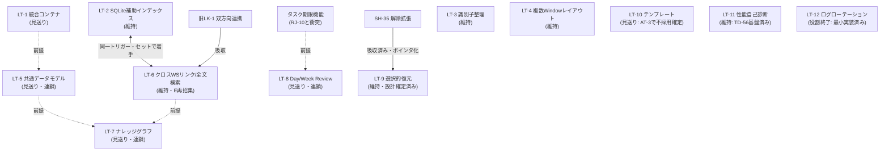

# NestSuite 長期backlogの採用・見送り・着手トリガー総点検（TD-89 / v2.18.23）

- 実施version: v2.18.23
- 対応ID: TD-89
- 種別: backlog総点検（プロダクトコード変更なし）
- 対象: `docs/backlog.md` の全未完了項目（総点検前 26件 + LT 12件 + RJ 10件 + TD-87予約 1件）
- 主な根拠文書: `docs/planning/attractiveness-review-2026.md`（§9 優先度再評価表・§12 見送り表・§13 エキスパート復帰判定）、`docs/archive/expert-review/review6-fable5.md` §（棚卸し表）、`docs/planning/review7-fable5.md`、`docs/planning/state-data-protection-boundary-review.md`、`docs/planning/keyboard-accessibility-cross-review.md`、`docs/archive/expert-review/review4/review5-fable5.md`
- 同目的の既存文書はない。attractiveness-review-2026.md は「魅力向上の観点からの優先度評価」、本書は「backlog全体の採用・見送り・トリガー確定」であり、本書は同文書の判断を引き継いで backlog 本体へ反映する実行編にあたる。

## 1. 結論

総点検前の未完了 39件（通常backlog 26 + LT 12 + TD-87予約 1）を全件分類し、分類不能を残さず次のとおり確定した。

| 区分 | 件数 | 内訳 |
|------|------|------|
| **残す項目** | **21** | 下記3区分の合計 |
| うち 通常エンジニア向け（着手トリガー不要） | 7 | L4, L10, M15, ID-4, ID-7, TD-83, TD-87 |
| うち トリガー待ち（通常backlog） | 8 | M13, ID-8, ID-12, CH-12, LK-2, LK-3, LK-4, TD-85（+ SH-35 は LT-9 への参照ポインタとして維持） |
| うち トリガー待ち（LT） | 6 | LT-2, LT-3, LT-4, LT-6, LT-9, LT-11 |
| **追加設計が必要な項目**（独立区分としては） | **0** | ただしトリガー待ち8件のうち M13/ID-8/CH-12 はトリガー成立後に FM-1 準拠の小規模設計レビューを、LK-2/3/4 は転送共通ヘルパー設計を経てから実装する |
| **エキスパート再招集対象** | **0**（現時点） | 将来、LT-2/LT-3/LT-4/LT-6 のトリガー成立時のみ再招集（§6） |
| **見送り・削除・整理** | **18** | 見送り13（SH-24, TN-4, M7, M8, ID-5, ID-13, CH-17, LK-5, LT-1, LT-5, LT-7, LT-8, LT-10）＋重複・吸収4（SH-35→LT-9 は行維持のポインタ化, TN-7→LK-2/3, LK-1→LT-6, LT-12 役割終了）＋RJ化1（H3→RJ-11） |

backlog は 26件 → 15件（通常backlog、SH-35ポインタ含む）+ LT 6件 = **21件**に整理された。全ての残存項目に着手トリガー（または「トリガー不要」の明示）と実装主体を付記した。

## 2. 分類基準

各項目を次のいずれか1つへ分類した（分類不能なし）。

| 分類 | 意味 | backlog上の扱い |
|------|------|----------------|
| A. 現行backlogへ残す | 価値・範囲が明確で維持する | 残す（C/Dの性質も併記） |
| B. トリガー待ち | 観測可能な着手条件の成立まで実装しない | 残す＋トリガー明記 |
| C. 通常エンジニア向け実装候補 | 範囲が固定済みでトリガー不要 | 残す＋「通常エンジニアで実装可能」明記 |
| D. 実装前に小規模設計レビューが必要 | 着手時に設計論点の確定が要る | Bに含め「着手時に設計レビュー」明記 |
| E. エキスパート再招集が必要 | §6の基準（保存形式・状態正本・大規模境界等）に該当 | 残す＋明記 |
| F. 見送り | 現時点で採用しない（恒久方針ではない） | 削除し欠番。再提案は新ID |
| G. RJへ移す | 恒久的に採用しない方針 | RJ- へ移動 |
| H. 重複・陳腐化・役割終了で削除 | 他項目と同一構想・実質完了 | 削除し吸収先を明記 |

判断基準: (1) 実利用要望の有無（観測された声がないものは推測で残さない） (2) 既存機能での代替可否 (3) 保存形式影響（ある場合は条件を厳格化） (4) 認知負荷（設定・常設UI・確認ダイアログの増加は減点） (5) 既存レビューの確定判断との整合（M18・AT系・LT-9・TD-86/88 の結論は再検討しない）。「削除すると思い出せない」だけの理由では残さず、履歴は本書・release notes・RJ で保持する。

## 3. 全項目一覧

凡例 — 実装主体: 通常=通常エンジニアで実装可能 / 設計後=着手時に小規模設計レビューを経て通常エンジニア実装 / E後=エキスパート設計後に通常エンジニア実装 / なし=当面実装しない。

| ID | 項目名 | 現行分類 | 新分類 | 優先度 | 着手トリガー | 実装主体 | 関連文書 | 判断理由 |
|----|--------|----------|--------|--------|--------------|----------|----------|----------|
| SH-24 | タブのクイックスイッチャー強化 | 未着手C | **F 見送り** | — | —（再提案は新ID） | なし | attractiveness §9 | Ctrl+Tab/Ctrl+1〜9/タブ一覧で到達可能。タブ過多で迷う実利用報告なし。機能増殖の抑制 |
| SH-35 | 恒久pending entryの解除拡張 | 未着手C | **H 重複解消（LT-9正本のポインタ化）** | C | LT-9フェーズ2と同一 | 通常（LT-9設計確定済み） | review5、LT-9行 | 実体はLT-9フェーズ2へ吸収済み。二重管理をやめ、行は「参照ポインタ」と明記して維持（完了扱いにはしない） |
| TN-4 | 保存間隔・パスのカスタマイズ | 未着手C | **F 見送り** | — | —（同期フォルダ要望の実報告があれば新ID） | なし | attractiveness §9/§12、review6 | 設定増はTempNestの軽さ・設定最小方針と逆行。実利用要望なし |
| TN-7 | スロットからWorkspaceへ投入 | 未着手C | **H LK-2/LK-3へ吸収** | — | 吸収先に同じ | — | attractiveness §7 | LK-2/LK-3と同一構想（ターゲット選択UI等の具体案は吸収先へ転記） |
| L4 | ワードラップ切替 | 未着手B | **C 通常エンジニア候補** | B | 不要 | 通常 | attractiveness §9 | WPF標準TextWrapping切替のみ。小さく安全な実用品質改善 |
| L10 | 右ペイン絞り込み | 未着手B | **C 通常エンジニア候補** | B | 不要 | 通常 | attractiveness §9 | L1と同系の既存パターン流用。小さく安全 |
| M7 | ノートブック名修飾リンク | 未着手C | **F 見送り** | — | —（再提案は新ID） | なし | attractiveness §9、review6 | 実利用要望なし。リンク解決変更のコストがニッチな利便に見合わない |
| M8 | 正規表現検索 | 未着手C | **F 見送り** | — | —（再提案は新ID） | なし | attractiveness §9、review6 | 実利用要望なし。認知負荷純増の懸念（review6） |
| M13 | ノート手動並び替え | 未着手B | **B トリガー待ち（着手時設計レビュー）** | C | M14表示ソートで不足という実利用の声（具体例つき）＋FM-1準拠最小設計成立 | 設計後 | attractiveness §9、FM-1 | `.notenest`スキーマ変更（order）を伴うため条件厳格化。M14の実利用を見てから |
| M15 | マーカー/タスク一括コピー | 未着手B | **C 通常エンジニア候補** | B | 不要 | 通常 | attractiveness §9（AT-3語彙統一と関連） | 保存形式変更なし。既存エクスポート系と語彙を揃えて実装 |
| H3 | ノートリンク視覚ハイライト | 未着手C | **G RJ化（RJ-11）** | — | —（エディタ方針見直し時のみ新ID） | なし | RJ-8、review6 | エディタ差し替え前提でWPF標準TextBox方針と恒久的に衝突。H3bで行ハイライト需要は充足済み |
| ID-4 | カード一覧のキーボード操作 | 未着手B | **C 通常エンジニア候補** | **A**（B→A） | 不要（必須部分） | 通常 | keyboard-accessibility-cross-review §8 | TD-88で範囲固定済み（Enter必須/矢印・Space任意/Delete不採用）。体感改善大・回帰小 |
| ID-5 | カード複数選択・一括操作 | 未着手B | **F 見送り** | — | —（再提案は新ID） | なし | review6、review7 §113 | 単体新機能凍結方針と衝突。単一選択モデル前提の現行構造への影響大。実利用要望なし |
| ID-7 | 検索語のカード内ハイライト | 未着手B | **C 通常エンジニア候補** | B | 不要（AT-2フェーズ1完了で順序制約解消） | 通常 | attractiveness §9（M17 helper流用） | 保存形式変更なし。M17の3-Run方式helperを流用可能 |
| ID-8 | カード手動並び替え | 未着手C | **B トリガー待ち（着手時設計レビュー）** | C | 既存並び順・シャッフルで不足という実利用の声（具体例つき）＋FM-1準拠最小設計成立 | 設計後 | attractiveness §9、FM-1 | `.ideanest`スキーマ変更を伴うため条件厳格化（M13と同構造） |
| ID-12 | タグAND絞り込み | 未着手B | **B トリガー待ち** | C | 1タグ絞り込みで目的カードへ到達できない実利用の具体例の報告 | 通常 | attractiveness §9/§392 | ID-14件数表示の実利用を見てから。保存形式変更なし |
| ID-13 | 簡易統計 | 未着手C | **F 見送り** | — | —（再提案は新ID） | なし | attractiveness §9/§12 | ID-14の色チップ件数で実質充足。常設情報の追加は認知負荷方針と逆行 |
| CH-12 | 発言者カスタマイズ | 未着手C | **B トリガー待ち（着手時設計レビュー）** | C | 4種で表現できない用途の実利用の声（具体例つき・複数）＋FM-1準拠最小設計成立 | 設計後 | attractiveness §9、FM-1 | `.chatnest`スキーマ影響。発言者4種固定は「思考の型」としての価値 |
| CH-17 | 送信前プレビュー | 未着手B | **F 見送り** | — | —（誤送信の実報告が複数あれば新ID） | なし | attractiveness §9/§12 | 編集・削除で回復可能。条件付き確認UIは軽さ・認知負荷方針と逆行 |
| LK-1 | NoteNest↔IdeaNest双方向連携 | 未着手C | **H LT-6へ吸収** | — | LT-6に同じ | — | attractiveness §9 | 双方向リンクはLT-6（クロスWorkspaceリンク基盤）と同一構想。重複解消 |
| LK-2 | TempNest→NoteNest昇格 | 未着手C | **B トリガー待ち** | C | 共通トリガー: TN-3昇格の実利用兆候 or 転送共通ヘルパー設計完了 | 設計後（ヘルパー設計） | attractiveness §7、review7 §4.1 | 転送導線は1本ずつ。TN-7の具体案を吸収 |
| LK-3 | TempNest→IdeaNestカード追加 | 未着手C | **B トリガー待ち** | C | LK-2と同じ | 設計後 | 同上 | 同上 |
| LK-4 | ChatNest発言→IdeaNestカード化 | 未着手C | **B トリガー待ち（第一候補）** | C | LK-2と同じ | 設計後 | attractiveness §7（第一候補指名） | 思考の流れ上で最も自然な転送。着手時はこれから |
| LK-5 | 選択テキスト横断クイック投入 | 未着手C | **F 見送り** | — | —（転送導線2本以上の実利用後に新IDで再評価） | なし | attractiveness §9 | 個別転送の実績ゼロの段階で汎用化を持つのは早すぎる |
| TD-83 | docs再判定 | 未着手C | **C 通常エンジニア候補** | C | 不要 | 通常 | docs-inventory-and-archive-policy | 小さなdocs整理。範囲固定済み |
| TD-85 | TutorialWindow削除判断 | 未着手C | **B トリガー待ち** | C | tutorial-assets-liveness.md記載の「将来の対応条件」いずれかの成立 | 通常 | tutorial-assets-liveness | 着手条件が既に観測可能な形で確定済み。成立前に完了判断しない |
| TD-87 | recent files quarantine | 予約のみ | **C 通常エンジニア候補（正式登録）** | C | 不要（範囲固定済み。急がない） | 通常 | state-data-protection-boundary-review §6 L1/§9 | 予約状態を解消し正式な行として登録。session/TD-65と同型の1 version規模、設計レビュー済み |
| LT-1 | 統合コンテナ形式 | LT保留 | **F 見送り** | — | —（複数Workspace 1ファイル受け渡しの実需要が観測されたら新ID＋FM-1準拠設計） | なし | FM-1 | 1タブ1ファイルで支障の観測なし。観測可能なトリガーを設定できない「いつか便利そう」項目 |
| LT-2 | SQLite補助インデックス | LT保留 | **B トリガー待ち** | — | SH-41方式の横断検索が実測で性能・件数限界に達した場合（LT-6と同一トリガー） | E後 | sqlite-index-feasibility §7、attractiveness §9 | feasibility済み・トリガー観測可能。維持 |
| LT-3 | 互換性識別子整理 | LT保留 | **B トリガー待ち** | — | 識別子変更を必要とする具体的な変更要求（リブランド・パス衝突等）の発生 | E後 | compatibility-identifiers-audit | 棚卸し済み・移行段階案あり。互換性識別子のためエキスパート基準に該当 |
| LT-4 | 複数Windowレイアウト保存 | LT保留 | **B トリガー待ち** | — | 別ウィンドウ配置が再起動で失われることへの実利用の不満（具体例つき） | E後 | design-decisions LT-4節 | session形式変更の可能性。トリガーを観測可能な形に明文化 |
| LT-5 | 共通データモデル化 | LT保留 | **F 見送り** | — | —（再提案は新ID） | なし | — | LT-1見送りで主前提が消失。大規模移行に見合う需要の観測なし。「高度で魅力的」だけの項目 |
| LT-6 | クロスWorkspaceリンク/全文検索 | LT保留 | **B トリガー待ち** | — | SH-41方式の横断検索の実測限界＋横断リンク・全文検索の実利用要望（LT-2とセットで着手） | **E再招集** | attractiveness §9 | LK-1を吸収し横断連携の親構想として維持。複数Workspaceの状態正本・スキーマに関わるため唯一のエキスパート再招集対象 |
| LT-7 | ナレッジグラフ | LT保留 | **F 見送り** | — | —（再提案は新ID） | なし | — | 前提LT-5が見送りで連鎖。UI/UXコスト大、軽さの方向性と不一致 |
| LT-8 | Day/Week Review | LT保留 | **F 見送り** | — | —（再提案は新ID） | なし | RJ-10 | 前提の期限機能がタスク縮退方針（RJ-10）と衝突。前提が方針レベルで崩れている |
| LT-9 | 選択的復元 | LT保留 | **B トリガー待ち（維持）** | — | review5確定の3トリガー（記述変更なし） | 通常（設計確定済み） | review4/5 | 設計・トリガー・技術的制約まで確定済みの模範例。SH-35をここへ一元化 |
| LT-10 | テンプレート機能 | LT保留 | **F 見送り** | — | —（再提案は新ID） | なし | attractiveness AT-3節 | AT-3で「テンプレート機構は作らない」と確定済み。実利用要望なし |
| LT-11 | パフォーマンス自己診断 | LT保留 | **B トリガー待ち（維持）** | — | 実利用での性能課題報告＋TD-56計測基盤の数値による裏づけ | 通常 | performance-measurement | 基盤整備済み・トリガー観測可能 |
| LT-12 | ErrorLogローテーション | LT保留 | **H 役割終了** | — | —（ログ量問題が再発したらerror-log-policy.mdに従い新ID） | — | error-log-policy | 最小実装済み（v2.14.0 TD-57）。残件のUI・設定画面は設定最小方針と逆行 |

## 4. すぐ通常エンジニアへ渡せる項目（7件）

| ID | 実装範囲の固定状況 |
|----|--------------------|
| ID-4 | **固定済み**（TD-88 §8: Enterプレビューのみ必須。任意部分は実機評価後） |
| TD-87 | **固定済み**（TD-86 §6 L1/§9: session/TD-65と同型のquarantine+ErrorLog） |
| L4 | 固定済みに近い（TextWrappingトグル＋メニュー項目。永続化の要否のみ着手時に判断） |
| L10 | 固定済みに近い（L1と同型のフィルタTextBox） |
| M15 | 固定済みに近い（全件コピー→Markdownリスト。既存エクスポート系と語彙統一） |
| ID-7 | 固定済みに近い（M17の3-Run分割helper流用） |
| TD-83 | 固定済み（docs-inventory-and-archive-policy の次回候補の再判定のみ） |

## 5. 小規模設計レビューが必要な項目（トリガー成立後）

| 対象 | 設計論点 | 成果物 |
|------|----------|--------|
| M13 / ID-8 | `order`相当フィールドのFM-1準拠最小スキーマ（後方互換読み込み・省略時挙動） | 各1枚の設計メモ（スキーマ差分と互換表） |
| CH-12 | 発言者定義の保存位置・既存4種との互換・色/配置の割当 | 同上 |
| LK-2/3/4 | 転送共通ヘルパー（review7 §4.1）: 転送元→転送先の共通インターフェース・確認UI・転送後クリアの扱い | ヘルパー設計レビュー1本（トリガー成立を待たず先行してよい唯一の設計作業 — attractiveness §393） |

## 6. エキスパート再招集対象

**現時点で 0 件**（すぐ再招集が必要な項目はない）。

将来トリガー成立時に再招集となるのは次のみ（attractiveness §390 の再レビュー条件と整合）:

- **LT-6（＋LT-2）**: クロスWorkspaceリンク・全文検索。複数Workspaceの状態正本・インデックス設計・スキーマに関わるため
- **LT-3**: 互換性識別子の変更（既存互換性識別子の変更に該当）
- **LT-4**: session形式変更を伴う場合のみ
- schema変更系（M13/ID-8/CH-12）は「エキスパート再招集」ではなく「着手時の小規模設計レビュー」で足りる（変更範囲が単一Workspace・単一フィールドに閉じるため）

「エキスパートがいたら安心」だけの項目は再招集対象にしていない。

## 7. トリガー待ち項目（14件）の着手条件一覧

| ID | 観測可能な着手条件 |
|----|--------------------|
| M13 | M14の表示専用ソートでは足りないという実利用の声が具体例つきで報告される ＋ FM-1準拠最小設計成立 |
| ID-8 | 既存の並び順・シャッフルでは目的の配置にできないという実利用の声が具体例つきで報告される ＋ FM-1準拠最小設計成立 |
| ID-12 | 1タグ絞り込みでは目的のカードへ到達できない実利用の具体例が報告される |
| CH-12 | 4種で表現できない用途の実利用の声が具体例つきで複数報告される ＋ FM-1準拠最小設計成立 |
| LK-2/3/4 | TN-3昇格導線が実際に使われている兆候の観測、または転送共通ヘルパー設計レビュー完了（着手はLK-4から・1 version 1本） |
| TD-85 | `tutorial-assets-liveness.md` 記載の「将来の対応条件」のいずれか成立 |
| SH-35(=LT-9) | LT-9フェーズ2の3トリガー（review5確定）のいずれか成立 |
| LT-2 / LT-6 | SH-41方式（逐次読み）横断検索の実測での性能・件数限界到達（LT-6はさらに横断リンク・全文検索の実利用要望の観測） |
| LT-3 | 識別子変更を必要とする具体的な変更要求（リブランド・パス衝突等）の実発生 |
| LT-4 | 別ウィンドウ配置が再起動で失われることへの実利用の不満の報告（具体例つき） |
| LT-9 | review5確定の3トリガー（実利用フィードバック2種 or SH-35拡張の実装判断） |
| LT-11 | 実利用での性能課題報告 ＋ TD-56計測基盤の数値による裏づけ |

## 8. 見送り・削除項目（18件）の理由

| ID | 区分 | 理由（分類コード） |
|----|------|--------------------|
| SH-24 | 見送り | 代替手段が十分（Ctrl+Tab/Ctrl+1〜9/タブ一覧）＋実利用需要なし |
| SH-35 | 重複解消 | LT-9フェーズ2へ吸収済み（行はポインタとして維持し完了扱いにしない） |
| TN-4 | 見送り | 実利用需要なし＋方向性と不一致（設定最小・TempNestの軽さ） |
| TN-7 | 吸収 | LK-2/LK-3と同一構想（既存項目と重複） |
| M7 | 見送り | 実利用需要なし＋複雑さがニッチな利便に見合わない |
| M8 | 見送り | 実利用需要なし＋認知負荷増の懸念 |
| H3 | RJ化(RJ-11) | 方向性と不一致（エディタ差し替え前提＝WPF標準TextBox方針と恒久衝突）。H3bで需要充足 |
| ID-5 | 見送り | 方向性と不一致（単体新機能凍結）＋実利用需要なし＋導入コスト大 |
| ID-13 | 見送り | 代替手段が十分（ID-14件数表示）＋常設情報追加が方針と逆行 |
| CH-17 | 見送り | 代替手段が十分（インライン編集・削除で回復可）＋認知負荷増 |
| LK-1 | 吸収 | LT-6と同一構想（既存項目と重複） |
| LK-5 | 見送り | 前提未成立（個別転送の実績ゼロで汎用化は早すぎる） |
| LT-1 | 見送り | 実利用需要なし＋観測可能トリガーを設定できない |
| LT-5 | 見送り | 前提機能（LT-1）が見送り＋保存形式変更コストが過大 |
| LT-7 | 見送り | 前提機能（LT-5）が見送り＋方向性と不一致（UI/UXコスト大） |
| LT-8 | 見送り | 前提機能（期限機能）がタスク縮退方針RJ-10と衝突 |
| LT-10 | 見送り | AT-3で「テンプレート機構は作らない」確定済み＋実利用需要なし |
| LT-12 | 役割終了 | 最小実装済み（v2.14.0）。残件は設定最小方針と逆行 |

いずれも再検討時は**新IDを採番**する（欠番の再利用禁止）。

## 9. LT項目の再整理（依存関係）

- 前提連鎖で崩れた候補: LT-5（←LT-1見送り）、LT-7（←LT-5見送り）、LT-8（←期限機能がRJ-10と衝突）
- LT-2とLT-6は相互参照で循環していたため、**共通の観測可能トリガー「SH-41方式横断検索の実測限界」に一本化**し、成立時はセットで着手する構造へ整理した
- 残るLT 6件はすべて「棚卸し/feasibility/設計が済んでいる」か「トリガーが観測可能」のいずれかを満たす

## 10. RJの整理

- **追加: RJ-11**（H3移動）— エディタ部品差し替えを前提とする視覚拡張の恒久見送り。RJ-8（WPF標準TextBox方針）と同根だが、RJ-8は「エディタ全面移行」、RJ-11は「差し替えを前提とする個別視覚拡張」を対象とし役割を分けた
- 統合・削除したRJ: なし（RJ-1〜RJ-10はいずれも現行方針を正しく表しており重複・陳腐化なし）
- 今回の見送り13件のうちRJ化はH3のみ。他は「現時点の見送り」であり恒久方針ではないため、履歴は本書と各セクションの欠番記録で保持する（RJの大量増加はしない）

## 11. 今後のbacklog運用ルール

`docs/backlog.md` §2「運用ルール」へ反映済み。

1. **着手トリガーのない長期候補を追加しない**（トリガーは観測可能な条件で書く。「必要になったら検討」不可）
2. **完了済み・見送り済みIDを再利用しない**（再検討は新ID採番）
3. **実装主体を明記する**（通常／着手時設計レビュー／エキスパート設計後）
4. **設計レビュー済みかを明記する**（レビュー文書があれば参照先を書く）
5. **実利用評価が必要な項目を推測で着手しない**（声が観測されるまで実装対象へ繰り込まない）
6. 保存形式変更を伴う項目は、トリガー成立に加えてFM-1準拠の最小設計成立を着手条件とする
7. TD-88等の横断レビューで抽出された小修正候補は、レビュー文書のversion分割表で管理しbacklogへ自動追加しない（着手時に新ID採番）

## 12. 確認できなかったこと

- 実利用要望の有無は、リポジトリ内文書（release notes・各レビューの「実機利用の声を待つ条件」）に記録された範囲でのみ判断した。文書外のユーザーフィードバックチャネルは本環境から確認できない
- 「タブ過多」「一覧の見通し」等の実際の利用規模は実機で観測していない（見送り判断はいずれも「報告があれば新IDで再評価」の退避条件つき）
