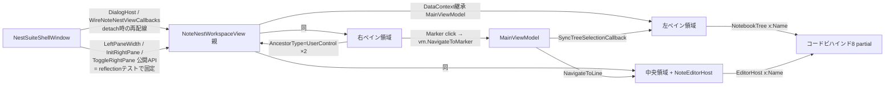

# M18 NoteNest画面XAMLのペイン別UserControl分割 — 採否・境界設計レビュー

- 対応ID: **M18**（v2.18.21として本レビューを実施。backlog上の未完了項目・v2.18.21未使用を確認済み）
- 種別: 設計レビューのみ（分割実装・XAML移動・UI変更なし）
- 既存判断との関係: `docs/planning/review7-fable5.md` §（M18行）は「保留寄り。変更頻度が分割コストに見合わない。ペインへの大きな変更が発生する時点で、そのペインだけ段階分割する」と評価し、`docs/planning/attractiveness-review-2026.md` §13/§14はM18を「トリガー待ち」「設計レビューだけを行ってよい4件」の1つとして維持している。本レビューはそのトリガー前の設計レビューに相当し、現行コードの実読で採否を確定する。

---

## 1. 結論

**見送り（現状維持）。** ただし、将来「対象ペインへの大きな変更」というトリガーが成立した場合に備え、その時点で分割してよい境界・DataContext・実装順を本文書§6〜§8で確定した（トリガー成立時に再設計へ戻る必要はない）。

見送りの最大の根拠は、**M18が目的とした「画面修正時に追う範囲の限定」が、現行構造で既におおむね達成されている**ことである:

1. **コードビハインドは既に責務別の8 partialへ分割済み**（`NoteNestWorkspaceView.xaml.cs` 239行を核に、`NoteEvents` 178 / `FilterEvents` 135 / `TaskEvents` 134 / `DragDrop` 91 / `EditorEvents` 81 / `LinkEvents` 26 / `ContextMenuEvents` 18行）。左ペインのノート操作を直すなら`NoteEvents`、絞り込みなら`FilterEvents`と、C#側の「追う範囲」はすでにペイン/機能単位で限定されている。
2. **最も複雑な中央エディタは既に`NoteEditorHost` UserControlとして抽出済み**（XAML 137行＋コードビハインド441行。明示イベント`OpenNoteLinkClicked`/`InsertNoteLinkClicked`・`EditorReady`・providerデリゲートによる公開面）。M18型の分割はエディタについて一度実施され、境界パターンも確立している。
3. **XAML 985行は`═══`区域コメントで5領域（Resources/3ペイン/スプリッター）に区切られ、`docs/development/workspace-xaml-structure.md`が領域索引として維持されている**。1機能の修正がXAML全体へ波及する構造ではない（後述§3の変更履歴分析）。
4. 逆に、いま分割すると**新たに増える認知負荷**（§2）が、残る削減余地を上回る。

## 2. 判断理由（減る認知負荷 vs 増える認知負荷）

### 分割で減るもの

- XAML 1ファイルの行数（985 → 各300〜400行程度×3）。
- 右ペインだけを変更するPRのdiffが右ペインファイルに閉じる（ただしコードビハインド側は既にpartialで閉じている）。

### 分割で増えるもの（実コードで確認した具体的根拠）

- **ContextMenuのDataContext中継**: ノートテンプレートのContextMenuは `DataContext="{Binding PlacementTarget.DataContext, RelativeSource={RelativeSource Self}}"` に加え、`Tag="{Binding DataContext, RelativeSource={RelativeSource AncestorType=UserControl}}"` を親DockPanelに仕込み、`PlacementTarget.Tag.HasSelectedNote` でMainViewModelのプロパティへ到達する2段トリックを使っている（XAML 214〜239行）。UserControl化すると`AncestorType=UserControl`の解決先が子UserControlへ変わる。子のDataContextも継承でMainViewModelになるため「動くはず」だが、この動作保証は実機確認が必要な暗黙依存であり、分割後は読む人がこの推論を毎回やり直すことになる。
- **`RelativeSource AncestorType=UserControl`が2箇所**: 上記Tagと、タスクグループヘッダーの `Command="{Binding DataContext.ToggleGroupCommand, RelativeSource={RelativeSource AncestorType=UserControl}}"`（610行）。分割後は参照先が変わるため書き換えと確認が必要。
- **ペイン幅・開閉の所有が親Grid**: `LeftPaneColumn`/`RightSplitterColumn`/`RightPaneColumn`は親の3ペインGridのColumnDefinitionであり、右ペインの折り畳み（`CollapseRightPane`/`ExpandRightPane`）は`RightPaneColumn.Width`・`RightGridSplitter.Visibility`・`RightPaneExpandButton`（Column 3、ペイン外）を同時に操作する。右ペインをUserControl化しても**開閉機構は親に残る**しかなく、分割の境界がUI上の「右ペイン」と一致しない。
- **公開APIがリフレクションテストで固定**: `WorkspaceViewRegressionTests`が`LeftPaneWidth`/`IsRightPaneCollapsed`/`ActualRightPaneWidth`/`InitRightPane`/`ToggleRightPane`/`NavigateToLine`/`SyncTreeSelection`等を公開契約として固定している。`SyncTreeSelection`は左ペインの`NotebookTree`のItemContainerGeneratorを直接操作し、`NavigateToLine`は中央の`EditorHost.Editor`を直接操作する。分割すると親→子の委譲層（子の明示メソッド）が各APIに1枚ずつ増える。
- **Shell・detached windowとの配線**: Shellは`WireNoteNestViewCallbacks`でVMの`NavigateToLine`/`SyncTreeSelectionCallback`/`NavigateToMarker`をこのViewへ配線し、detach/reattachのたびに配線し直す。右ペインのマーカークリック→`vm.NavigateToMarker`→左ペインのツリー選択＋中央のエディタスクロール、という**ペイン横断フローが正常系**であり、分割はこのフローに委譲段を追加するだけで簡素化しない。
- **静的XAMLテストの追従**: `NestSuiteShellXamlTests`（NoteNestWorkspaceView.xamlを7箇所で読み込み）・`L24RelatedNotePickerXamlTests`・`M14NoteSortModeXamlTests`が単一XAMLパス前提。分割時は読み込み対象の複数化かhelper集約が必要（弱体化なしで移行可能だが、コストは発生する）。
- **ファイル数増**: XAML+cs+partial再配置で、現在の「9ファイル（XAML1+partial8）」が「XAML3〜4＋cs各1＋残partial」へ増える。追う範囲の限定は既にpartialで得ているため、純増分は主に「どのXAMLに書いてあるか」の探索1段。

### 変更頻度の観点

このXAMLの2026年の実変更は、L23空状態案内・L24関連ノート選択ボタン・SH-30ツールチップ等の小規模追加が中心で、review7時点の「直近変更は2回のみ」から状況は大きく変わっていない（v2.18.13〜20の魅力向上局面でもNoteNest XAMLはほぼ触れていない）。**分割コストを回収する変更頻度が依然ない。**

## 3. 現行構造

### 視覚的ペインと機能責務（実測: XAML 985行）

| 領域 | XAML行範囲（目安） | 内容 | 対応コードビハインドpartial |
|------|------|------|------|
| Resources | 8〜91 | `TaskItemTemplate`（タスク行＋ContextMenu＋ドラッグ） | TaskEvents / DragDrop |
| 左ペイン | 104〜312 | プロジェクト名ヘッダー・絞り込みバー・NotebookTree（Notebook/Noteテンプレート＋ContextMenu）・空状態×2・追加ボタン | NoteEvents / FilterEvents / DragDrop / ContextMenuEvents |
| 中央ペイン | 318〜522 | サンプルバナー・タイトルバー（保存・フォントサイズ・Markdownエクスポート ContextMenu）・関連ノートバー・`NoteEditorHost`・マーカー挿入ボタン | EditorEvents / xaml.cs（Markdownエクスポート） |
| 右ペイン | 546〜983 | タスク互換表示（グループ・完了セクション）・マーカー/リンクTabControl・空状態 | TaskEvents / LinkEvents |
| スプリッター・開閉 | 314〜544 | GridSplitter×2・右ペイン開閉ボタン | xaml.cs（Collapse/Expand） |

### DataContext・Command

- DataContextは全域で単一の`MainViewModel`を継承。ペイン別ViewModelは存在しない（`LinkPanel`はMainViewModel配下のサブVMで、Bindingパス経由）。
- Commandバインドは`SaveProjectCommand`/`NewProjectCommand`/`SaveAsProjectCommand`/`ToggleGroupCommand`/`ToggleCompletedSectionCommand`等。大半の操作はClickハンドラ（View責務のダイアログ・確認・フォーカスを伴うため意図的にコードビハインド。`docs/development/workspace-view-responsibilities.md`の既存方針）。

### 壊れやすい参照の全数調査結果

- `ElementName=NoteFilterBox`（1箇所、左ペイン内で完結）
- `RelativeSource AncestorType=UserControl`（2箇所、§2記載）
- `RelativeSource AncestorType=ContextMenu`＋`PlacementTarget.Tag`（ノートContextMenuのMarkdownエクスポート3項目）
- `x:Name`: `LeftPaneColumn`/`RightSplitterColumn`/`RightPaneColumn`/`NoteFilterBox`/`NoteFilterClearButton`/`NotebookTree`/`EditorHost`/`RightGridSplitter`/`RightPaneExpandButton` — うち`NotebookTree`（SyncTreeSelection・GetSelectedNotebook）・`EditorHost`（NavigateToLine・マーカー挿入・リンク操作）・`NoteFilterBox`（FilterEvents）はコードビハインドから頻繁に参照
- `x:Reference`・Storyboard TargetName・`FocusManager.IsFocusScope`: 使用なし
- InputBinding: MouseBinding×2（タスクグループ開閉）。KeyBindingなし（Ctrl+S等はShell/DetachedWindow側）

### フォーカス

`EditorHost.Editor.Focus()`（NavigateToLine・マーカー挿入後）・`NoteFilterBox.Focus()`（クリア後）。フォーカススコープの追加なし。Tab順はビジュアルツリー順の既定。

## 4. 依存関係一覧

## 5. 比較した案

| 案 | 評価 | 採否 |
|----|------|------|
| **案A 現状維持** | 追う範囲の限定はコードビハインドpartial＋区域コメント＋構造索引文書で既に確保。回帰リスクゼロ | **採用** |
| 案B 小さな部分分割（右ペインのみ等） | 最有力対案。右ペインは`AncestorType=UserControl`×2・タスクDataTemplate（Resources領域）・開閉機構（親所有）が境界をまたぎ、「右ペインのXAML」と「右ペインの責務」が一致しない。トリガー未成立の現在は正味マイナス | 見送り（トリガー成立時の第1候補として§6で境界確定） |
| 案C ペイン単位3分割 | 案Bの課題に加え、公開API委譲層・テスト追従が3倍。ペイン横断フロー（マーカー→ツリー→エディタ）に委譲段が増える | 見送り |
| 案D 機能単位分割（MarkerList等の小領域） | マーカー一覧・リンク一覧は独立性が高く技術的には最容易（ElementName依存なし・イベント2つ）。ただし1ファイル200行前後の抽出で得る探索性向上が、ファイル増と`TaskItemTemplate`のResourceスコープ調整に見合わない | 見送り |
| 案E 大幅View再構成 | タスク指定によりM18範囲外 | 対象外 |

## 6. 採用する境界（将来トリガー成立時のみ。今回は実装しない）

「対象ペインへの大きな変更」が発生した時点で、**変更が発生したペインだけ**を次の境界で分割する:

### 第1候補: 右ペイン `NoteNestReferencePaneView`（右ペインに大きな変更が来た場合）

- 責務: タスク互換表示・マーカー/リンクTabControl・各空状態（XAML 546〜983行相当）
- DataContext: **親の`MainViewModel`をそのまま継承**（DependencyPropertyは作らない）
- 移動するResource: `TaskItemTemplate`を子のResourcesへ（使用箇所が右ペインのみのため）
- 書き換える参照: `AncestorType=UserControl`×2はそのままでも子UserControl経由で同じMainViewModelに解決されるが、意図を明示するため`ToggleGroupCommand`側は`AncestorType=UserControl`のまま子を指す形を実機確認のうえ維持、または`ItemsControl.DataContext`基点の明示パスへ書き換え
- 移動するコードビハインド: `TaskEvents`・`LinkEvents`の全ハンドラ、`DragDrop`のタスク系ハンドラ（partial単位でほぼそのまま移せる）
- 公開面: なし（イベント・メソッド・DPゼロ。マーカークリックは現行どおり`vm.NavigateToMarker`経由でVMへ届き、ペイン横断はShell配線が担うため子→親の直接連絡は不要）
- 親に残す: `RightPaneColumn`・`RightGridSplitter`・`RightPaneExpandButton`・`CollapseRightPane`/`ExpandRightPane`（開閉はレイアウト責務）

### 第2候補: 左ペイン `NoteNestNavigationPaneView`（左ペインに大きな変更が来た場合)

- 責務: プロジェクト名ヘッダー・絞り込み・NotebookTree・空状態・追加ボタン（XAML 104〜312行相当）
- DataContext: 親の`MainViewModel`を継承
- 公開面: `SyncTreeSelection(NoteViewModel)`と`GetSelectedNotebook()`相当の**明示メソッド2つ**（親の公開APIは子へ委譲して維持し、リフレクションテストの契約を変えない）。`NoteFilterBox`関連は`FilterEvents` partialごと子へ移動
- 注意: ノートContextMenuの`PlacementTarget.Tag`トリックが子UserControl基点になるため、Markdownエクスポート3項目の`IsEnabled`到達を実機確認必須

### 中央ペイン: 分割しない

`NoteEditorHost`として実効部分は抽出済み。残り（バナー・タイトルバー・関連ノートバー・挿入ボタン）は薄いchromeで、これ以上の分割は不要。

## 7. 親Viewに残す責務

3ペインGrid・GridSplitter×2・ペイン幅／開閉（公開API含む）・`DialogHost`・Shell配線の受け口（`NavigateToLine`・`SyncTreeSelection`の公開シグネチャ）・Markdownエクスポート（タイトルバーContextMenuとノートContextMenuの両方から呼ばれる共有処理）・`DragDropState`。

## 8. 実装順（トリガー成立時。1 version = 1 purpose）

- **フェーズ1**: トリガーが発生したペイン1つのみをUserControl化（§6の境界。対象XAML領域＋対応partialの移動、`workspace-xaml-structure.md`・静的XAMLテストの読み込み対象更新、既存テスト維持）。実機確認: ContextMenu全項目・D&D・フォーカス・テーマ・ペイン開閉・detached window。ロールバック: 1コミットrevertで戻る規模に収める
- **フェーズ2**: 別ペインへのトリガーが発生した場合のみ同様に実施
- 全面一括分割は行わない（一括の方が安全である理由は存在しない）

## 9. 回帰リスク（分割を実施する場合）

| 項目 | リスク |
|------|------|
| DataContext | 低（単一VM継承のため）。ただしContextMenu系は中 |
| ContextMenu | **中〜高**: `PlacementTarget.Tag`＋`AncestorType`2段トリックの解決先変化。実機確認必須 |
| NameScope | 中: `NotebookTree`/`EditorHost`等を親コードビハインドが直接参照している箇所は子への委譲メソッド化が必要 |
| フォーカス・Tab順 | 低〜中: フォーカススコープは増えないが、ビジュアルツリー順の変化がないことの確認は実機 |
| テーマ | 低: 全色DynamicResource参照でありスコープ非依存 |
| GridSplitter・ペイン幅 | 低: 親に残すため不変。子へ移すと高になる（移さないこと） |
| ショートカット | 低: KeyBindingはこのXAMLに存在しない |
| AutomationProperties | 低: 要素ごとに付与済みでスコープ非依存 |
| テスト | 中: 文字列XAMLテスト3ファイルの読み込み対象更新、reflectionテストは公開API維持で不変 |

## 10. テスト方針（分割を実施する場合）

- `WorkspaceViewRegressionTests`（reflection）: 親の公開APIを委譲で維持し**無変更で通す**
- 文字列XAMLテスト（`NestSuiteShellXamlTests`のNoteNest7箇所・`L24…`・`M14…`）: 対象XAMLパスを分割後ファイルへ変更、または「NoteNest系XAML全結合を返すhelper」を1つ用意して期待値を不変に保つ（後者を推奨。期待文字列自体は変えない）
- `ArchitectureBoundaryTests`: スキャン対象ディレクトリに新partial/csを追加
- 新規追加は「分割後も旧XAMLに存在した契約文字列が全ファイル結合に残る」ことの確認程度に留め、全文固定はしない
- 実機確認へ残す: ContextMenu・D&D・フォーカス復帰・detached window・テーマ切替

## 11. 非対象

今回: 分割実装・XAML移動・UI変更・ViewModel/MainViewModel分割・Shellリファクタリング・保存/dirty/session変更・DI/Behavior/EventAggregator導入・エディタ差し替え。実装フェーズでも: RichTextBox化・Markdownエディタ・テーマ再設計・アクセシビリティ全体改修・全Workspace共通View基盤。

## 12. 見送りに伴う代替策

実質的な代替策は**既に実施済み**であることを確認した: (a) コードビハインドの領域別partial化（8ファイル）、(b) XAMLの`═══`区域コメント、(c) `docs/development/workspace-xaml-structure.md`の領域索引、(d) 中央エディタの`NoteEditorHost`抽出。追加で行う価値のある小整理は現時点でない（Resource分離は`TaskItemTemplate`1つのみで効果薄、x:Name命名は一貫済み）。よって見送りに伴う追加作業は本文書の記録のみとし、便乗整理は行わない。

**backlog上の扱い**: M18は本レビューをもって「見送り（判断完了）」として未完了一覧から外す。将来トリガー（対象ペインへの大きな変更）が成立した場合は、本文書§6〜§10を設計正本として新IDを採番して実装する（backlogへの事前追加はしない）。
