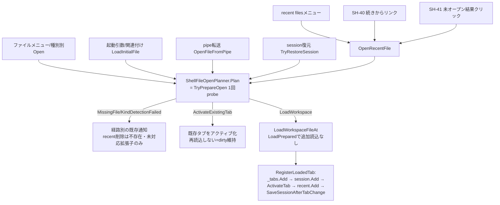
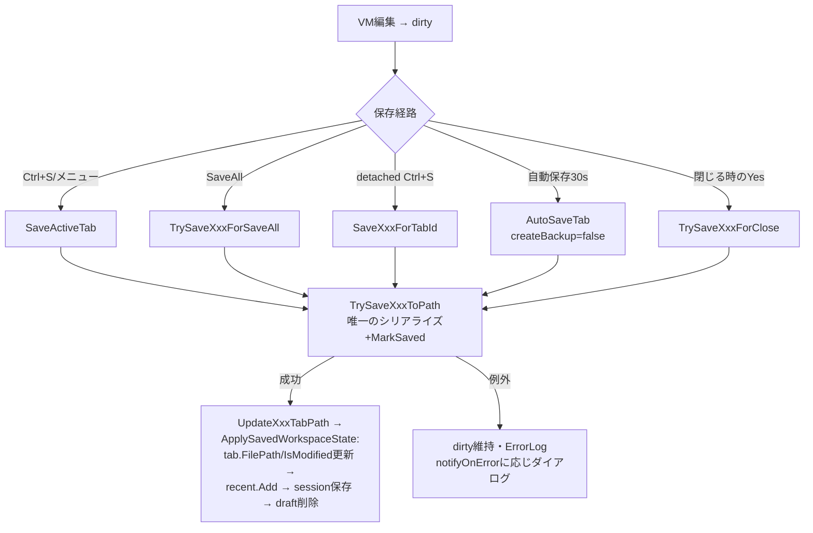
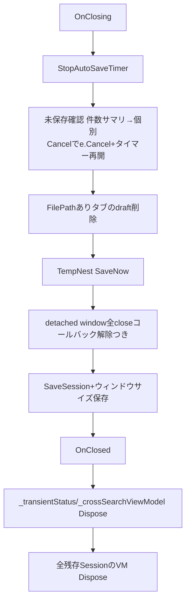

# NestSuite 状態管理・データ保護・責務境界の総合アーキテクチャレビュー

- 対応ID: **TD-86**（backlog.md/release-notes.mdで未使用を確認済み）
- 対象version: v2.18.19 時点の現行コード（v2.18.20 として本レビューを実施）
- 種別: レビュー・設計判断のみ（新機能・リファクタリング・保存形式変更なし）
- 既存文書との関係: session復元系は `docs/archive/expert-review/review1〜5-fable5.md`、二重読込は `docs/archive/completed-designs/nestsuite-double-read-design-review.md`、保存フロー重複は `docs/development/save-flow-duplication.md`、detached windowは `docs/architecture/workspace-detached-window.md` が既存の正本。本文書はそれらを置き換えず、**v2.18.19時点の完成形を横断照合した結果**を記録する。個別テーマの詳細は各既存文書を参照のこと。

---

## 1. 結論

**現行設計を維持してよい。**

CriticalおよびHighに該当する構造的リスクは確認されなかった。データ消失・上書き・復元事故・二重処理につながる現実的な経路は、現行コードの読解とその契約を固定している既存テストの照合の範囲では見つからなかった。Medium 0件・Low 4件を§6に記録した。いずれも即時修正を要さず、「文書化のみ」または「将来の小規模修正候補」である。

根拠の要約:

1. **状態の正本が一意に特定できる**（§3）。dirtyな編集内容の正本は各Workspace ViewModelのメモリ内容であり、recent files・session・draft・`.bak`・検索スナップショットはすべて補助状態として設計・実装されている。補助状態が正本を上書きする経路は存在しない。
2. **ファイルを開く全経路が単一の共通経路に合流している**（§4.1）。TD-59系で確立した `ShellFileOpenPlanner.Plan` → `TryPrepareOpen` → `LoadPrepared` → `LoadWorkspaceFileAt`/`ActivateExistingTabForOpen` を迂回する独自実装は、SH-40/SH-41追加後も存在しない。二重読込の再発もない。
3. **保存の不変条件が構造的に保証されている**（§4.2）。「シリアライズ+MarkSavedは各Workspaceにつき1箇所」「シリアライズ失敗時はMarkSavedも状態更新も実行されない（dirty維持）」がTD-45の共通化とリフレクションテスト（`NestSuiteShellSaveFlowTests`）で固定されている。
4. **全保存・全状態遷移がUIスレッド上で逐次実行される**。自動保存は`DispatcherTimer`、SH-41の読込だけが唯一のバックグラウンド処理だが読み取り専用であり、書き込み系の並行実行は構造的に発生しない。

---

## 2. 対象範囲

### 確認したコード（実読）

- Shell partial一式: `NestSuiteShellWindow.xaml.cs`（コンストラクター・OnClosing・OnClosed）、`.Session.cs`、`.FileOpen.cs`、`.FileSave.cs`、`.FileSaveAs.cs`（署名確認）、`.FileSaveStateSync.cs`、`.SaveAll.cs`（save-flow-duplication.md経由で契約確認）、`.AutoSave.cs`、`.DraftRecovery.cs`、`.TabClose.cs`、`.TabDetach.cs`、`.TabLifecycle.cs`、`.WorkspaceFileHelper.cs`、`.CrossSearch.cs`、`.GettingStartedHint.cs`、`.ContinueFromPanel.cs`、`.StateSummary.cs`、`.TempNestPromotion.cs`
- サービス: `NestSuiteTabFactory`（`TryPrepareOpen`）、`NestSuiteWorkspaceEnvelope`、`ProjectFileService`/`IdeaNestFileService`/`ChatNestFileService`（`LoadPrepared`/`Save`）、`AtomicFileWriter`、`NestSuiteRecentFilesService`、`NestSuiteSessionStateService`、`SessionTabMapper`、`DraftStore`、`TempNestStoreService`、`ShellSearchService`、`UnopenedRecentFileLoader`、`ErrorLogService`、`NestSuiteOpenFilePolicy`、`ShellFileOpenPlanner`（Plan結果の利用側）、`NestSuiteWorkspaceSessionManager`、`BackupRestoreGuideProvider`
- ViewModel: `ShellSearchPanelViewModel`、`TempNestWorkspaceViewModel`/`TempNestSlotViewModel`、`IdeaNestWorkspaceViewModel`（Undo・dirty・Dispose）、`ChatNestWorkspaceViewModel`/`MainViewModel`は保存契約（`MarkSaved`/`SaveToPath`/`IsDirty`/`HasUnsavedChanges`）の呼び出し面のみ

### 確認した永続ファイル

`%APPDATA%\NoteNest\` 配下: `nestsuite-session.json` / `nestsuite-recent-files.json` / `tempnest.json` / drafts（tabId単位+sidecar）/ `ui-settings.json` / ErrorLog。利用者ファイル: `.nestsuite`（wrapper 1.0）+ legacy 3拡張子 + `.bak`。

### 確認した既存文書

`docs/design/design-decisions.md`、`docs/architecture/schema-versioning-policy.md`、`docs/development/save-flow-duplication.md`、`docs/development/error-log-policy.md`（方針参照）、`docs/development/compatibility-identifiers-audit.md`（存在確認）、`docs/testing/attractiveness-regression-v2.18.19.md`、`docs/archive/completed-designs/nestsuite-double-read-design-review.md`、`docs/archive/expert-review/review1〜5-fable5.md`（session系の設計判断）、`docs/planning/at1-*`/`at2-*` 設計レビュー。

---

## 3. 状態の正本一覧

| 状態 | 正本 | 派生・キャッシュ | 永続化先 | 更新責務 | 破棄責務 | 再生成 | 競合時の優先 |
|------|------|------|------|------|------|------|------|
| 開いているタブ一覧 | `_tabs`（Shell） | `_sessionManager`（1:1対応、Shellが同期責務） | session.json（保存済みタブのみ） | Shell（タブ追加/削除/Replace） | Shell（CloseTab/OnClosed） | sessionから部分再生成 | メモリが正 |
| アクティブタブ | `_selectedTab` | session.json `ActiveFilePath` | session.json | `ActivateTab` | — | 復元時に再選択 | メモリが正 |
| Workspace本文・カード・発言 | 各Workspace ViewModel（メモリ） | 保存ファイル・draft・`.bak`・SH-41スナップショット | `.nestsuite`/legacy | VM（編集）+保存経路 | CloseTab/OnClosedのDispose | ファイルから | **dirtyメモリが常に優先**（不変条件I1） |
| dirty状態 | NoteNest/IdeaNest: `tab.IsModified`/`HasChanges`。ChatNest: `IsDirty`（永続化対象）と`HasUnsavedChanges`（InputText含む）の2値 | タブの●表示 | なし（意図的） | VM編集+`MarkSaved` | 保存成功時のみ解除 | — | 保存失敗時は解除されない（不変条件I2） |
| 保存済みFilePath | `tab.FilePath`（recordのため`ReplaceTab`で更新） | `session.FilePath` | session.json | `ApplySavedWorkspaceState`（唯一の定義点） | タブ閉鎖 | — | タブが正 |
| WorkspaceKind | タブ生成時に`TryPrepareOpen`が内容から確定 | session.json `Tabs[].WorkspaceKind`は**UI表示ヒントのみ**（TD-68で信頼ソースでないことを明文化） | session.json（ヒント） | probe時のみ | — | ファイルから再判定 | **ファイル内容が正**、sessionヒントを信用しない |
| recent files | `nestsuite-recent-files.json` | `_recentFilesCache`（メニュー再構築のたび更新）、SH-40表示、SH-41候補 | 同左 | `RegisterLoadedTab`/`ApplySavedWorkspaceState`/`ActivateExistingTabForOpen`→`Add`、open失敗時の`Remove` | `Clear`メニュー | 利用で再蓄積 | **正本ではない**。開く時に実ファイル・既存タブを再判定 |
| session | `_tabs`+`_pendingSessionRestoreEntries`（メモリ）→終了時・変更時に書き出し | session.json | session.json | `SaveSession`/`SaveSessionAfterTabChange`（復元中は抑止） | 破損時`.corrupt`退避 | — | メモリが正。json破損時は空sessionで継続（TD-65） |
| session復元失敗entry | `_pendingSessionRestoreEntries` | — | session.jsonへ持ち越し（既存Tabs[]形式のまま） | `TryRestoreSession`が設定 | FileNotFoundのみ利用者確認で解除（SH-34）。他は保持（LT-9フェーズ2で拡張予定、トリガー待ち） | — | 黙って消えない（不変条件I3） |
| draft | drafts/{tabId}（wrapper JSON+sidecar） | — | 同左 | 自動保存tick（`DraftCandidatePolicy`該当時） | 保存成功後・タブ閉鎖・正常終了・利用者破棄。破損はquarantine退避（削除しない） | 次tickで再生成 | 正本ではない。復元は無題タブ（IsModified=true）として開き、正本ファイルを上書きしない |
| TempNest | `TempNestWorkspaceViewModel`（メモリ） | — | tempnest.json（1sデバウンス+終了時SaveNow） | VM自身 | なし（常駐） | — | メモリが正 |
| `.bak` | 手動保存時の直前正本のコピー | — | 正本と同じ場所 | `AtomicFileWriter.WriteAllTextWithBackup`（手動保存のみ。自動保存は更新しない=TD-64） | 利用者 | — | 自動復元経路なし。復元は手動手順のみ（`BackupRestoreGuideProvider`） |
| 横断検索結果 | `ShellSearchPanelViewModel.Results`/`UnopenedResults`（表示のみ） | — | なし（意図的に非永続） | `RunSearch` | `Reset`（パネル閉鎖） | 都度再計算 | 正本ではない |
| 未オープンrecent filesスナップショット | `_unopenedSnapshot` | — | なし | チェックON時の1回読込 | OFF/Reset/Dispose/再ON | 再ONで再読込 | **正本ではない**。検索時に開いているパスを都度除外し、dirtyメモリを優先（不変条件I4） |
| detached windowの所属 | `_detachedWindows`（tabId→Window）+`tab.IsDetached` | — | なし（レイアウト非保存は既知制限） | Detach/ReAttach/CloseTab/OnClosing | 同左 | — | Workspace VMインスタンスは常に1つをShellと共有（不変条件I5） |

**複数表現の評価**: `_tabs`と`_sessionManager`の二重管理は「タブ表示モデル（record）」と「VM所有」の責務分離であり、追加・削除が常に対で行われることをShellが保証している（CloseTab・RegisterLoadedTab・draft復元のロールバックまで対で実装済み）。ChatNestのdirty 2値（`IsDirty`/`HasUnsavedChanges`）は「保存されるもの」と「失われるもの（InputText）」の区別として必要な二重表現で、その使い分けは`FileSaveStateSync.cs`と`AutoSave.cs`の各1箇所に集約されている。いずれも統合を提案しない。

---

## 4. 状態遷移の確認結果

### 4.1 Open・復元

- 全10経路（メニュー・種別別・recent・引数・関連付け・pipe・session復元・SH-40・SH-41・detached経由保存後の再オープンなし）が`Plan`に合流することをコードで確認した。SH-40/SH-41はv2.18.17/18で`OpenRecentFile`を共有する形で実装されており、独自オープン処理の複製はない。
- 二重読込（TD-59系）の再発なし: SH-41の読込も`TryPrepareOpen`のprobe結果（`Preloaded`）を`LoadPrepared`へ渡す1回読み。session復元も`SessionRestoreTarget.OpenContext`の1回読み（TD-59b-4）を維持。
- 例外は**draft復元**のみ`Plan`を使わず`TryPrepareOpen`を直接呼ぶが、対象がdrafts配下の内部ファイル（利用者パスでない）であり、重複判定はtabId衝突（collision-pair書き込み+ロールバック）で別途担保されている。意図的な別経路として現状維持（§7）。

### 4.2 編集・保存

- 保存失敗の握り潰しなし: `serializeAndMark`クロージャが例外を投げると`MarkSaved`も状態更新も走らない（TD-45契約、リフレクションテストで固定）。NoteNestは`vm.SaveToPath`が成功時のみtrueで、falseなら`UpdateNoteNestTabPath`を呼ばない。自動保存失敗はdirty維持+同一タブ1回のみ通知+成功でリセット。
- 保存中の重複実行: すべての保存はUIスレッド（`DispatcherTimer`含む）で逐次実行され、同時並行の保存は構造的に発生しない。detached windowのCtrl+SもShellの同じ`TrySaveXxxToPath`へ委譲される。
- `.bak`: 手動保存のみ更新（TD-64）。自動保存はatomic writeのみ。SaveAs時の重複タブ検出（`CheckAndActivateDuplicateTabForSave`）が「開いている別タブのファイルへ上書き保存してdirty内容を壊す」経路を塞いでいる。

### 4.3 終了・破棄

- 二重Dispose: `CloseTab`はDispose後に`_sessionManager.Remove`するため、`OnClosed`の残存Session走査と重複しない。TempNest VMのDisposeは`_disposed`ガードつき。
- draft: 正常終了で保存済みタブのdraftは削除、無題dirtyタブのdraftは（sessionに含まれない代わりに）次回起動の復元ダイアログで回収される。強制終了時はTD-66の随時session保存+30s間隔draftが安全網。

### 4.4 session・recent・draft・TempNest・SH-40/AT-5の整合

- **古い補助状態が正本を上書きする経路なし**: recent filesは開く時に常に実ファイル・既存タブを再判定。sessionの`WorkspaceKind`ヒントは復元時に信用されない（TD-68）。draft復元は無題タブとして開き元ファイルへ書き戻さない。SH-41スナップショットは読み取り専用でパネル寿命。
- **復元失敗entryが意図せず消えない**: 復元中は`_isRestoringSession`で随時保存を抑止し（TD-66）、`SaveSession`は`_pendingSessionRestoreEntries`を開いているタブと重複しない範囲で常に持ち越す（TD-65/TD-69の単一導出）。解除はFileNotFoundの利用者確認のみ（SH-34）。
- **不要entryが永久に残る条件**: InvalidFormat/AccessDenied/SchemaVersionTooNewのentryはファイル側が解消されるまで残る。これは既知・意図的な設計（LT-9フェーズ2の対象、トリガー待ち）であり、user guideに間接解除経路（ファイル削除→FileNotFound化→解除）が記載済み。**既存設計との矛盾なし。今回LT-9の再設計はしない。**
- **recent削除条件の経路別整合**: 削除は「開こうとして不存在」「未対応拡張子」の2条件のみで、recentメニュー・SH-40・SH-41クリックが同一の`OpenRecentFile`を共有するため経路間の不一致はない。SH-41の読込失敗・session復元失敗では削除しない（一時障害と区別できないため）。一貫している。
- **SH-40とAT-5の排他**: `ShouldShowGettingStartedHint`が`!ShouldShowContinueFrom`を含む導出プロパティであり、状態遷移（候補設定・項目削除によるフォールバック・通常タブ追加ラッチ）のどの時点でも両立しない。`SH40ContinueFromPanelTests.AT5_And_ContinueFrom_AreNeverBothTrue`が固定。draft保持件数はdraftダイアログの決定**後**に算出されるため復元・破棄後の不整合もない。

### 4.5 dirty優先・detached・非同期（§6/§7/§8観点）

- **dirty優先**: 同一ファイルを別経路から開こうとすると`Plan`の既存タブ検出が先に働き再読込しない。SH-41は候補選定時と検索実行時の二重で開いているパスを`NestSuiteOpenFilePolicy.IsSameFile`（唯一のパス比較ポリシー）により除外。session復元は起動時（dirtyメモリが存在しない時点）のみ。**dirtyメモリがディスク内容に置き換わる経路は確認されなかった。**
- **detached window**: VMインスタンスはShellと共有（1所有）。detachはViewの差し替えのみで、タブ・session登録は変化しない。閉じる系はすべて`OnDetachedClosed = null`でコールバックを外してからCloseし、reattach処理の二重実行を防いでいる。二重保存・二重session登録の経路なし。detachedレイアウト非保存は既知制限として文書化済み。
- **非同期（SH-41）**: 唯一のバックグラウンド処理。CTS+世代番号の二重ガードで、OFF/Reset/再ON/Disposeの各時点から古い完了結果がUIへ反映されないことをテストで固定。1ファイル同期読込中の中断不可は設計文書・release notesに明記済みの許容制約。書き込みを一切行わない読み取り専用処理のため、競合しても正本への影響はない。

---

## 5. 不変条件（実装確認済み）

- **I1**: 同一ファイルの開いているdirtyメモリ内容は、ディスク内容・recent files・session・draft・検索スナップショットのいずれよりも常に優先される。既存タブがある限り再読込は発生しない。
- **I2**: dirtyは保存成功時のみ解除される。シリアライズ・書き込みの失敗時に`MarkSaved`・タブ状態更新は実行されない。
- **I3**: session復元失敗entryは、FileNotFoundに対する利用者の明示確認以外の経路で消えない。復元処理中の随時session保存は抑止される。
- **I4**: SH-41の未オープンスナップショットは正本ではなく、永続化されず、検索実行のたびに開いているパスが除外される。
- **I5**: Workspace VMインスタンスの所有は常に一意（Shellの`_sessionManager`）。detached windowは同一インスタンスの別Viewであり、保存・破棄・session登録の主体はShellのみ。
- **I6**: `.bak`は手動保存時のみ更新され、自動復元されない。復元は利用者の手動手順のみで、手順は元ファイルの退避を前提とする。
- **I7**: `WorkspaceKind`はファイル内容から都度判定され、session内のヒント文字列を復元判定に使わない。
- **I8**: すべての状態変更（保存・タブ操作・session書き出し）はUIスレッド上で逐次実行される。バックグラウンドはSH-41の読み取りのみ。

---

## 6. 指摘一覧

**Critical: 0件 / High: 0件 / Medium: 0件 / Low: 4件**

| # | 重要度 | 対象 | 内容 | 発生条件・利用者影響 | 推奨対応 |
|---|--------|------|------|------|------|
| L1 | Low | `NestSuiteRecentFilesService.Load` | 破損JSONを`catch { return []; }`で黙殺し、履歴全消失が無通知・無退避・ErrorLogなし。session（`.corrupt`退避+ErrorLog、TD-65）・UI settings（M19復旧通知）と復旧方針が非対称 | recent files JSONが破損した場合のみ。履歴は利用で再蓄積可能な補助状態のため実害は小 | **文書化のみ（本記録）**。将来、session同様のquarantine+ErrorLogを加える小修正候補（TD-87候補、1 version規模）。正本でないため急がない。**[v2.19.2 追記] TD-87で対応済み**: session（TD-65）と同型の`.corrupt`（既存なら日時付き）退避＋ErrorLog記録を実装し、破損時も空履歴で起動継続する |
| L2 | Low | `ShellSearchPanelViewModel`の`_postToUiThread`（`Dispatcher.Invoke`） | アプリ終了と読込完了が重なると、Dispatcher停止後のInvokeがバックグラウンドTask内で例外になり得る（unobserved task exceptionとなり、プロセスは既に終了過程のため実害なし・ErrorLogにも残らない） | Shell終了の瞬間にSH-41読込が完了する稀なタイミングのみ。クラッシュ・データ影響なし（`OnClosed`のDisposeで世代が無効化済み） | **現状維持**。理論上の競合であり、修正（Dispatcher状態チェック追加）の複雑性が利益を上回る。本記録をもって文書化とする |
| L3 | Low | ChatNest/IdeaNestのタブ閉鎖確認 | 個別タブ閉鎖はDiscard/Cancelの2択で保存オプションがない（NoteNestのみ3択）。保存パスを持つdirtyタブでは最大30s分（+ChatNestのInputText）の未保存分が破棄され得る | 確認文言が破棄を明示しており、自動保存（30s間隔）が損失窓を限定。長年の意図的設計（save-flow-duplication.md §0-3に記録済み） | **現状維持**。UX変更（3択化）は実機の声があれば別途判断。構造的リスクではない |
| L4 | Low | `MainViewModel.Dispose`/`ChatNestWorkspaceViewModel.Dispose`の多重呼び出し耐性 | TempNest VMのような`_disposed`ガードの有無を全VMで確認しきれていない。現行の呼び出し構造（CloseTabでsession除去→OnClosedは残存のみ走査）では多重呼び出し自体が発生しないため、実害の経路はない | 呼び出し経路上は発生しない。将来、Dispose呼び出し箇所を増やす変更をした場合のみ顕在化し得る | **文書化のみ**。§8の禁止事項に「Dispose呼び出し経路を増やす場合はガードを確認する」を追加して担保 |

いずれの指摘も「今すぐ修正」に該当しない。今回のレビューPRでは実装修正を行わない（タスク方針どおり）。

---

## 7. 現状維持と判断した事項

1. **`_tabs`と`_sessionManager`の二重管理**: 表示モデルとVM所有の責務分離。統合はrecord型タブの利点（`ReplaceTab`による安全な更新）を失う。
2. **ChatNestのdirty 2値**: 永続化される変更と失われる一時入力の区別に必要。集約点は既に1箇所ずつ。
3. **draft復元が`Plan`を経由しないこと**: 対象が内部ファイルで、重複判定の軸がパスでなくtabIdのため。共通化するとcollision-pairロールバックが複雑化する。
4. **pending entryの恒久残留（InvalidFormat等）**: LT-9フェーズ2の既存設計・着手条件と整合。再設計しない。
5. **recent filesの重複Add時の全読込**（`Add`が毎回`Load`する）: 10件上限の小さなJSONで、atomic writeと整合性を優先した現行実装が単純。性能問題なし。
6. **NoteNest保存経路（`vm.SaveToPath`）をTD-45共通化に含めないこと**: save-flow-duplication.md §0-3の判断を再確認。エラー処理の所在が異なり、巻き込むと影響が拡大する。
7. **SH-41の1ファイル同期読込の中断不可・ファイル内タイムアウトなし**: 設計レビュー時の受容判断を維持。読み取り専用のため正本への影響なし。
8. **detachedレイアウトの非保存**: 既知制限として文書化済み。session形式変更を伴うため現状維持。
9. **`SessionManager.Add`の同一TabId上書き許容**: 防御的仕様。GUID発行のため通常衝突せず、上書きの方が例外より安全。

---

## 8. 将来の実装者向け禁止事項（事故防止境界）

現行コードに合わせて確定した、変更時に破ってはならない境界:

1. **共通Open経路を迂回しない**: ファイルを開く新経路は必ず`ShellFileOpenPlanner.Plan`（内部で`TryPrepareOpen`1回probe）へ合流させ、`LoadWorkspaceFileAt`/`OpenRecentFile`を再利用する。`File.ReadAllText`＋独自パースの追加は禁止。
2. **保存成功前にdirtyを解除しない**: `MarkSaved`と状態更新は`TrySaveXxxToPath`のクロージャ内（成功パス）以外に書かない。`isModifiedAfterSave`の決定は`FileSaveStateSync.cs`以外に持たせない。
3. **recent files・sessionヒントを正本として扱わない**: recent filesからWorkspaceKind・存在有無を推定してUI以外の判断に使わない。`Tabs[].WorkspaceKind`は表示ヒント専用。
4. **一時検索スナップショット・検索結果を永続化しない**: SH-41スナップショット・検索語・チェック状態をファイル・UI settingsへ書かない。
5. **WorkspaceKindの再判定のためだけに再読込しない**: probe済み`WorkspaceFileOpenContext`を経路の最後まで引き回す（TD-59系契約）。
6. **`_pendingSessionRestoreEntries`を新しい保存経路で消さない**: session保存を追加する場合は必ず`SessionTabMapper.CreateSessionState`経由で持ち越す。復元中の保存は`_isRestoringSession`を尊重する。
7. **保存・タブ操作をUIスレッド外へ移さない**: バックグラウンド処理を増やす場合は読み取り専用に限定し、CTS+世代番号のパターン（`ShellSearchPanelViewModel`参照）を踏襲する。
8. **VMのDispose呼び出し経路を増やす場合は多重呼び出しガードを確認する**（§6 L4）。`CloseTab`のように「Dispose→session除去」の順序を守る。
9. **`.bak`の自動復元・検索対象化をしない**: AT-2設計レビュー・TD-64の判断を維持。
10. **自動保存で`.bak`を更新しない**（TD-64）: `createBackup: false`契約を新しい自動経路にも適用する。

---

## 9. 修正候補の実装単位（今回は未実装）

| 候補 | 内容 | 規模 | 優先度 |
|------|------|------|--------|
| TD-87候補 | recent files破損時のquarantine退避+ErrorLog記録（session/TD-65と同型の最小実装） | 1 version | 低（補助状態のため） |

これ以外の実装候補はない。backlogへの自動追加は行わず、次の開発判断時に採否を決める。

---

## 10. 未確認事項

- Windows実機でのGUI操作を伴う動作確認（本レビューは静的読解+既存テスト+CIによる。v2.18.19の総点検文書の未確認事項リストが引き続き有効）。
- `MainViewModel.Dispose`/`ChatNestWorkspaceViewModel.Dispose`の多重呼び出し耐性の網羅確認（§6 L4。現行の呼び出し構造では発生しないため、境界則（§8-8）での担保に留めた）。
- メモリ使用量・リークの実測（コード上の参照保持は§4.5のとおり問題を確認できなかったが、実測はLT-11基盤による別途計測が必要）。
