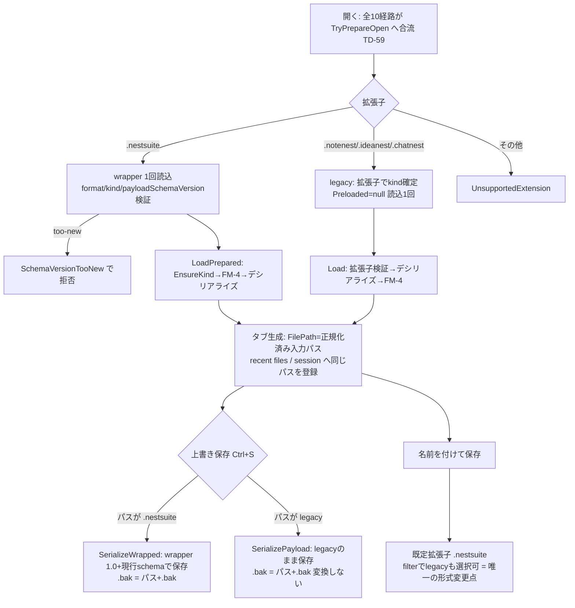

# NestSuite 保存形式・後方互換・移行・配布境界の総合レビュー(TD-90 / v2.18.24)

- 実施version: v2.18.24
- 対応ID: TD-90(backlog.md / release-notes.md で TD-90・v2.18.24 が未使用であることを確認済み)
- 種別: 総合レビュー(プロダクトコード変更なし・schema変更なし・migration実装なし)
- 確認方法: 静的確認(実装・テスト・文書の実読)。Windows実機でのファイル関連付け・EXE差し替え・ネットワークパス・別ドライブ保存の動作確認は本環境(Linux CLI)では実施できず、§17「未確認事項」へ分離した。
- 同目的の既存文書はない。`docs/architecture/schema-versioning-policy.md` は「方針」、本書は「現状の実装が方針どおりかの監査＋互換性マトリクス＋将来変更時の判断基準」であり、方針文書を置き換えない(参照して補完する)。

## 1. 結論

**現行設計を維持してよい。保存形式・互換性・移行・配布境界に、ブロッキングとなる構造的リスク(Critical/High)は確認されなかった。**

- 3 Workspace形式(.notenest / .ideanest / .chatnest)と `.nestsuite` wrapper のいずれも、未来schemaの読込を `SchemaVersionGuard.EnsureNotNewer`(数値比較)で明示拒否しており、「未来版ファイルを開いて再保存し未知フィールドを消す」経路は payload レベルで遮断されている(FM-4、v2.14.4)。
- 全Workspace保存は `AtomicFileWriter`(tmp+`File.Replace`)経由で、`.bak` 作成失敗時は `File.Replace` 自体が失敗して保存失敗になる(=.bak失敗の黙殺なし)。dirty解除(`MarkSaved`)は保存成功後のみ(TD-45契約、TD-86で確認済み)。
- legacy拡張子を開いても自動変換は起きない(保存形式は保存先パスの拡張子だけで決まり、上書き保存はlegacyのまま。Save Asの既定のみ `.nestsuite`)。
- 指摘は Medium 2件・Low 4件で、いずれも将来変更時の事故可能性または文書整合であり、今すぐの修正を要しない(§12)。

## 2. 対象範囲

- コード: `NestSuiteWorkspaceEnvelope` / `SchemaVersionGuard` / `NestSuiteTabFactory`(TryPrepareOpen / FromResolvedKind / IsPathCompatibleWithResolvedKind) / `ProjectFileService` / `ProjectDocumentService` / `IdeaNestFileService` / `IdeaNestWorkspaceService` / `ChatNestFileService` / `TempNestStoreService` / `NestSuiteSessionStateService` / `NestSuiteRecentFilesService` / `DraftStore` / `UiSettingsService` / `ErrorLogService`(+`ErrorLogRotation`) / `AtomicFileWriter` / `NestSuiteOpenFilePolicy` / `SavedWorkspaceStateUpdater` / `FileAssociationService` / `NestSuiteSingleInstance` / `MigrationPackService` / `NestSuiteShellWindow.FileSave/FileOpen` / `DialogService`(Open/Saveフィルタ)
- 文書: schema-versioning-policy.md、workspace-file-extension-unification.md、compatibility-identifiers-audit.md、file-association.md、error-log-policy.md、state-data-protection-boundary-review.md(TD-86)、backlog-adoption-trigger-review.md(TD-89)、nestsuite-double-read-design-review.md、nestsuite-release-checklist.md、ideanest-save-load-plan.md(archive)
- テスト: SchemaVersionGuardTests、NestSuiteWorkspaceEnvelopeTests、ProjectFileServiceTests、NoteNestFormatRoundTripTests、NoteNestFormatSchemaVersionTests、IdeaNest/ChatNest FileServiceTests、各FormatSchemaRegressionTests、AtomicFileWriterTests、SessionFormatSchemaRegressionTests、NestSuiteSessionStateServiceTests、RecentFilesServiceTests、DraftStoreTests、FileAssociationServiceTests、MigrationPackServiceTests

## 3. 保存形式一覧

| 形式 | 用途 | 保存先 | version field | 現在値 | 正本性 | 破損時挙動 | 未来version時 | atomic write / .bak |
|------|------|--------|---------------|--------|--------|-----------|--------------|---------------------|
| `.nestsuite` wrapper | Workspace標準拡張子 | 利用者指定パス | `formatVersion`(+`payloadSchemaVersion`) | 1.0 | **正本** | InvalidFormat(開けない・元ファイル不変) | payloadSchemaVersionは拒否。**formatVersion自体は未判定(§12 ST-1)** | tmp+Replace / 手動保存時 `.bak` |
| `.notenest`(legacy) | NoteNest本体 | 利用者指定パス | `version` | schema 1.4.2 | **正本** | 読込失敗(元ファイル不変) | `EnsureNotNewer` で拒否 | 同上 |
| `.ideanest`(legacy) | IdeaNest本体 | 利用者指定パス | `version`(必須) | 1.1.4 | **正本** | 読込失敗 | 拒否。**旧versionも厳密一致で拒否(§12 ST-2)** | 同上 |
| `.chatnest`(legacy) | ChatNest本体 | 利用者指定パス | `version` | 0.4.1 | **正本** | 読込失敗 | 拒否(旧: 要約→結論マッピング・未知speakerスキップで読める) | 同上 |
| tempnest.json | TempNest 4スロット | `%APPDATA%\NoteNest\` | `Version`(int) | 1 | 補助(だが本文を持つ) | ErrorLog+空スロット継続(**退避なし**) | 判定なし(補助状態として許容) | tmp+Replace / .bakなし |
| nestsuite-session.json | タブ構成復元 | 同上 | なし | — | 補助 | ErrorLog+`.corrupt`退避+空継続(TD-65) | 判定なし | random-tmp+Replace / .bakなし |
| nestsuite-recent-files.json | 最近使ったファイル | 同上 | なし(パス配列) | — | 補助 | **黙殺で空継続(退避・ErrorLogなし → TD-87登録済み)** | 判定なし | 同上 |
| drafts\draft-{tabId}.nestsuite | 無題タブ30秒下書き | `%APPDATA%\NoteNest\drafts\` | wrapper準拠 | 1.0 | 補助(復元候補) | `.corrupt-日時`退避+起動継続 | wrapper経由で判定 | tmp+Replace / .bakなし |
| draft-{tabId}.state.json(sidecar) | ChatNest transient状態 | 同上 | `draftFormatVersion` | 1.0 | 補助 | InvalidFormat/HashMismatch分類+退避 | **厳密一致で拒否(UnsupportedVersion)** | tmp+Replace |
| ui-settings.json | UI設定 | `%APPDATA%\NoteNest\` | なし | — | 補助 | `.corrupt`退避+既定値+復旧通知(M19) | 判定なし(値単位でValidate/Normalize) | 保存側atomic |
| logs\nestsuite-error.log | ErrorLog | `%APPDATA%\NoteNest\logs\` | なし | — | 診断用 | — | — | 1MB・3世代ローテーション |
| `.bak` | 手動保存時の1世代バックアップ | 正本+`.bak` | 正本準拠 | — | バックアップ | — | — | `File.Replace` の第3引数で原子的に生成 |

## 4. 互換性マトリクス(Workspace正本形式)

読込可否・再保存の要点(共通: **読込に失敗しても元ファイルは一切変更されない**。開くだけでは書き込みゼロ)。

| 入力 | 読込可否 | 利用者通知 | 再保存結果 | 情報欠落リスク |
|------|----------|-----------|-----------|----------------|
| 現行版が書いた現行形式 | ○ | — | round-trip 等価(テストあり) | なし |
| NoteNest 旧schema(0.1.0〜1.4.1) | ○(optional欠落は既定値でメモリ補完) | なし | **versionは現行1.4.2へ更新して保存**(ProjectDocumentService.Build) | なし(minor系は追加のみの採番ルール) |
| IdeaNest 旧version(例 0.1.0) | **×(NotSupportedException で明示拒否)** | エラーダイアログ | 保存に至らない | なし(開けないだけ。§12 ST-2) |
| ChatNest 旧0.4.1系(要約speaker) | ○(要約→結論へマッピング) | なし | マッピング後の内容で保存 | 未知speaker行はスキップされ再保存で消える(§12 ST-5) |
| 未来schema(1.4.3+/1.1.5+/0.4.2+) | **×(SchemaVersionTooNew)** | 「より新しいバージョンのNestSuiteで作成された可能性」文言 | 保存に至らない | **なし(これが未知field喪失の遮断)** |
| version欠落 | NoteNest/ChatNest: ○(旧ファイル互換で許容) / IdeaNest: ×(必須field) | IdeaNestのみエラー | — | なし |
| version不正文字列(パース不能) | NoteNest/ChatNest: `EnsureNotNewer`は数値比較不能でInvalidData失敗 / IdeaNest: TryParse不能なら厳密一致判定でNotSupported | エラー | 保存に至らない | なし |
| JSON破損 | ×(InvalidFormat) | エラー(SH-31分類文言) | — | なし |
| 同一version内の未知field | ○(System.Text.Jsonが無視) | なし | **未知fieldは消える** | §6のとおり「未来versionはbump必須」の採番ルールが前提のため実害なし |
| 旧拡張子(.notenest/.ideanest/.chatnest) | ○(拡張子でkind判定・wrapperなし読込) | なし | **legacyのまま保存(自動変換なし)** | なし |
| `.nestsuite`(kind不一致) | ×(EnsureKind「〜ではなく〜のWorkspaceです」) | エラー | — | なし |
| `.nestsuite`(payloadとwrapperのversion矛盾: payload>宣言) | ×(EnsureEnvelopeConsistent) | エラー | — | なし |

## 5. wrapper・legacy の Open / Save 遷移

- **legacyファイルを開いただけでは `.nestsuite` へ変換されない**(Saveは `IsEnvelopePath(path)` の分岐のみ。確認: ProjectFileService.Save / IdeaNestFileService.Save / ChatNestFileService.Save)。
- recent files・session・`.bak` はすべて「開いた/保存したそのままのパス」を使う(形式ごとの分岐なし)。
- 起動引数・関連付け・pipe転送・session復元も同じ `TryPrepareOpen` へ合流する(TD-59、double-read-design-review §8)。

## 6. 未知フィールド評価

| 層 | 挙動 | 分類 |
|----|------|------|
| payload(3形式共通) | 読込時は無視(System.Text.Json既定)。再保存で失われる | **未来versionを拒否するため実害なし**: schema-versioning-policy の採番ルールが「field追加=version bump必須」であり、bumpされた未来版はFM-4ガードで読込自体を拒否する。未知fieldが存在し得るのは手編集ファイルのみで、これは保護対象の契約外 |
| wrapper(format/formatVersion/workspaceKind/payloadSchemaVersion/payload以外) | 読込時は無視(Envelope.Read のドキュメント化済み仕様)。再保存はWrapで再生成するため失われる | **同一formatVersion内では許容された制約**。ただし未来のwrapper formatVersion(例 2.0)を現行版が**拒否しない**ため、「未来wrapperの追加項目を読める形で開き、1.0として再保存して失う」経路が理論上残る(§12 ST-1、Medium) |
| 未知 speaker(ChatNest) | 読込時スキップ・再保存で消える | 発言者追加はversion bump必須(CH-12の着手条件に明記済み)のため、bumpされていれば too-new 拒否で保護される。同一version内の未知speakerは手編集のみ(§12 ST-5、Low) |
| JsonExtensionData | **不使用**(全形式) | 意図的。未知field保持機構は導入しない方針(policy §前方互換ガード)を維持 |

「JSONとして読める」と「安全に再保存できる」の区別は、FM-4(too-new拒否)+採番ルール(変更=bump)の組で担保されている。**この保護はすべて「未来版が必ずversionをbumpする」規律に依存する**ため、§14 の禁止事項に明記する。

## 7. schema bump・migration 判断表(将来変更の種類別)

| 変更の種類 | schema bump | wrapper bump | migration | 専用backup | 利用者確認 | 旧versionサンプルテスト | 備考 |
|------------|------------|--------------|-----------|-----------|-----------|------------------------|------|
| optional field追加(既定値で補完可) | **必須**(minor/patch) | 不要 | 不要(読込時メモリ補完) | 不要(通常`.bak`で足りる) | 不要 | **必須** | M12(IsStarred, 1.4.1→1.4.2)が先例。M13/ID-8/CH-12の想定形 |
| 必須field追加・意味変更・構造変更 | 必須(major/minor) | 不要 | **必須(明示的migration)** | **必須**(通常`.bak`と別の保全) | **必須** | 必須+migration失敗時の元ファイル保持テスト | 現行に先例なし。エキスパート設計後に実装 |
| field削除・型変更 | 同上 | 不要 | 必須 | 必須 | 必須 | 必須 | 原則回避(policy「最終手段」) |
| wrapper構造変更(payload位置・必須項目) | — | **必須**+旧版拒否ガードの整備 | 場合による | 必須 | 必須 | wrapper新旧両サンプル | ST-1の解消(formatVersionガード)を先に行うこと |
| 保存先パス・ファイル名変更(補助状態) | — | — | 旧パス読込+新パス保存の段階移行 | 推奨 | 不要 | 旧パス互換テスト | LT-3の移行段階案に従う |
| Save Asによる形式変更(legacy↔wrapper) | 不要 | 不要 | 不要(別ファイルとして書くだけ) | 不要(元ファイル不変) | 利用者自身の操作 | 既存カバー済み | 現行で唯一の「形式が変わる」操作 |

## 8. Atomic write・`.bak` の差異整理

| 対象 | 方式 | .bak | 差異の分類 |
|------|------|------|-----------|
| 3 Workspace手動保存/Save All | `WriteAllTextWithBackup`(tmp+`File.Replace(tmp, path, path+".bak")`) | あり(1世代) | **統一済み**(FM-5)。`.bak`を作れない場合は`File.Replace`ごと失敗し保存失敗扱い=「.bak失敗を無視して保存成功扱い」は構造上起きない |
| 3 Workspace自動保存(TD-64) | `WriteAllText`(tmp+Replace/Move) | **なし**(手動保存時の`.bak`を上書きしないため) | 意図的差異(自動保存が良品`.bak`を壊さない) |
| 新規保存(ファイル未存在) | tmp+`File.Move` | なし(置換対象がない) | 意図的 |
| session/recent files | `WriteAllTextWithRandomTemp`(ランダムtmp名) | なし | 意図的差異(並行書込でtmp名衝突しない。補助状態のため`.bak`不要) |
| tempnest.json / draft / sidecar | `WriteAllText`(固定tmp名) | なし | 歴史的差異だが安全(単一書込点) |
| 保存失敗時 | 例外→`MarkSaved`未実行→dirty維持(TD-45)。NoteNestはVM側で同契約 | — | 3 Workspace一致(TD-86 I系不変条件で確認済み) |
| 別ドライブ/ネットワークパス | `File.Replace`は同一ボリューム前提だが、tmpは正本と同ディレクトリに作るため通常は同一ボリューム。ネットワークパスでの`File.Replace`挙動は実機未確認(§17) | — | — |

エンコーディングの差(NoteNest/ChatNest=UTF-8 BOMあり、IdeaNest/tempnest/draft=BOMなし)は各形式の既存ファイルとの互換維持のための**意図的差異**であり、統一しない(AtomicFileWriterのXMLコメントにも明記あり)。

## 9. 補助状態の破損・互換整理

| 形式 | 破損時退避 | 空継続 | ErrorLog | 未来version拒否 | 正本性 |
|------|-----------|--------|----------|----------------|--------|
| session | `.corrupt`退避(TD-65) | ○ | ○ | なし(形式にversionなし) | 補助 |
| recent files | **なし(黙殺)** | ○ | **なし** | なし | 補助 |
| draft本体 | `.corrupt-日時`退避 | ○(起動継続) | ○ | wrapper経由で拒否 | 補助(復元候補) |
| draft sidecar | 退避+状態分類(HashMismatch等) | ○ | ○ | **厳密一致拒否**(1.0以外はUnsupportedVersion) | 補助 |
| tempnest.json | **なし(空スロット継続)** | ○ | ○ | なし(Version=1は書くが読込で未判定) | 補助(本文を持つが再蓄積不能な点は他と異なる) |
| ui-settings | `.corrupt`退避+復旧通知(M19) | ○(既定値) | ○ | なし(値単位Validate) | 補助 |

- **TD-87の設計範囲は妥当**: recent filesだけが「退避なし・ErrorLogなし」で、session(TD-65)と同型のquarantine+ErrorLogを足す1 version規模という既存設計(state-data-protection-boundary-review §6 L1/§9)は本レビューでも正しい対処と確認した。今回実装しない。
- tempnest.json破損時に本文が退避されない点は、TD-87と同型の将来候補として§12 ST-4に記録(Low。スロット4件・自動保存1秒周期で損失窓は小さいが、recent filesと違い「利用で再蓄積」できない)。
- 補助状態に未来version拒否がない点は、正本でなく「読めなければ空で継続」が成立するため**許容された制約**(新版が形式を変える場合は旧版が壊れず空継続できる形を保つこと — §14へ)。

## 10. 互換識別子

`compatibility-identifiers-audit.md` の棚卸し(A=維持/B=移行設計つき変更可/C=変更可/D=保留)と現行コードの一致を確認した。

| 識別子 | 現行値(コード確認) | 分類 | 一致 |
|--------|--------------------|------|------|
| AppDataフォルダ | `%APPDATA%\NoteNest` (TempNestStore/Session/Recent/UiSettings/DraftStore/ErrorLog全一致) | A(当面維持) | ○ |
| Mutex名 | `Local\NoteNest_NestSuite_{user}` (`NestSuiteSingleInstance`) | A | ○ |
| Pipe名 | `NoteNest_NestSuite_{user}_S{session}` | A | ○ |
| ProgId | `NoteNest.nestsuite/.notenest/.chatnest/.ideanest` (`FileAssociationService`) | A | ○ |
| 拡張子定数 | 各FileServiceの`FileExtension`に集約(v2.14.8) | A | ○ |
| 設定キー `NoteNestEditorFontSize`等 | ui-settings.json内フィールド名として維持(L21→L22移行はフィールド追加+読込フォールバックで実施済み=先例) | A/B | ○ |
| 永続ファイル名 | tempnest.json / nestsuite-session.json / nestsuite-recent-files.json / ui-settings.json | A | ○ |

- 単純なNestSuite名称への置換は行わない(LT-3のトリガー「識別子変更を必要とする具体的な変更要求の実発生」成立まで移行設計を実装しない)。
- 変更する場合に必要となるもの: 段階移行(旧パス読込→新パス保存)・旧識別子の読込互換期間・関連付けの二重登録期間と旧ProgId掃除・ロールバック手順(新パスに書いたものを旧パスへ戻せること)・既存インストールのMutex/Pipe不一致による二重起動転送の断絶考慮。これらはaudit §3の移行段階案と一致しており、追記不要。
- `WorkspaceEditorFontFamily`(L22)の「新フィールド追加+旧フィールド読込フォールバック+保存は新フィールドへ」は、設定キー移行の**参照実装**としてLT-3着手時に踏襲するとよい。

## 11. 配布境界(単一EXE・関連付け・並存)

| ケース | 現行挙動(静的確認) | 評価 |
|--------|--------------------|------|
| 同じ場所へ新EXE上書き | 関連付けコマンドは同一パスを指したまま → そのまま有効 | 推奨配布手順。起動中の上書きはWindowsがEXEロックするため失敗する(利用者案内: 終了してから差し替え) |
| 別フォルダへ新EXE配置 | 関連付けは旧EXEパスを指す。`FileAssociationService.GetStatus`が「現在のEXEと不一致」を検出し、ダイアログから再登録可能 | 検出+再登録導線あり。案内事項として§17に実機確認を残す |
| 旧新版並存起動 | Mutex/Pipeがバージョン非依存の共通名のため、2つ目の起動はバージョンを問わず先着プロセスへファイルパスを転送して終了する | 意図的(1ユーザー1インスタンス)。「旧版と新版を同時に使う」運用は不可 — 配布案内に含めるべき事項 |
| 旧版で新版のファイルを開く | payload version bumpがあればFM-4系ガード(v2.14.4以降の旧版)で明示拒否。**v2.14.3以前の旧版にはガードがない**が、それらの版が読める旧schemaのファイルに限り開ける(bump済みファイルはデシリアライズ結果が不定) | 既知の境界。「新版で保存したファイルを旧版で開かない」を利用者案内へ(policy文書に既記載) |
| 新版で旧版のファイルを開く | §4のとおり読込互換あり | ○ |
| 関連付け未登録/手動起動 | 起動引数・pipe転送とも`TryPrepareOpen`合流で同一検証 | ○ |
| インストーラー/自動更新 | 不使用(手動差し替えのみ)。レジストリ書込はHKCU配下のみ(管理者権限不要) | 方針どおり |

手動差し替え配布で利用者へ最低限案内すべき事項(ドキュメント候補、今回は本書への記録のみ): (1) 差し替え前にNestSuiteを終了する (2) EXEの置き場所を変えたら関連付けダイアログで再登録する (3) 旧版EXEを残しても同時起動はできない (4) 新版で保存したファイルを旧版で開かない。

## 12. 指摘一覧

Critical / High: **なし**。

| ID | 重要度 | 対象 | 発生条件 | 利用者影響 | 原因 | 推奨対応 | 実装主体 |
|----|--------|------|----------|-----------|------|----------|----------|
| ST-1 | Medium | `.nestsuite` wrapper の formatVersion | 将来版がwrapper構造を変えて formatVersion を 2.0 に上げ、かつ payloadSchemaVersion を上げない場合に、現行版が読めてしまい 1.0 として再保存 → wrapper層の追加情報を喪失 | 現時点では発生し得ない(1.0のみ存在)。将来のwrapper変更時のみ | `NestSuiteWorkspaceEnvelope.Read` が formatVersion を返すだけで比較していない(payload側のFM-4に相当するガードがwrapper層にない) | ①別version候補 **ST-1a**: `EnsureNotNewer(formatVersion, "1.0")` の1箇所追加(通常エンジニア・1 version) ②schema-versioning-policy のwrapper節へ「wrapper変更時は必ずpayloadSchemaVersionも上げるか、formatVersionガードを先に配布する」を追記(①とセット) | 通常エンジニア |
| ST-2 | Medium | IdeaNest 旧version読込 | version が `1.1.4` 以外(例: IdeaNest v0.x の `0.1.0`)の `.ideanest` を開く | 「未対応の IdeaNest バージョンです」で開けない(データは壊れない)。NoteNest/ChatNestは旧versionを読めるため形式間で挙動が異なる | `IdeaNestFileService.ValidatePayload` の厳密一致検証(NestSuite統合以前からの既存挙動)。archiveの `ideanest-save-load-plan.md` §1 は「0.1.0=旧形式」として認識する表を載せており実装と記述がずれている | **歴史的差異だが安全**として現状維持。旧IdeaNestファイルを開けないという実利用報告があった場合のみ、旧version読込(欠落field既定値補完)を別version候補 **ST-2a** として実装 | トリガー待ち(報告後は通常エンジニア) |
| ST-3 | Low | recent files 破損時の黙殺 | recent files JSON破損 | 履歴が無通知で空になる(再蓄積可能) | `catch { return []; }` | **TD-87(backlog登録済み・設計範囲妥当と確認)**。本レビューでの追加作業なし | 通常エンジニア(TD-87) |
| ST-4 | Low | tempnest.json 破損時の本文非退避 | tempnest.json破損 | 4スロットの本文が失われ空スロットで継続(ErrorLogは残る)。recent filesと違い利用で再蓄積できない | 破損時 `CreateEmptySlots()` で継続し退避しない | TD-87と同型のquarantine追加を将来候補 **ST-4a** として記録(backlogへは追加しない)。次の上書き保存(1秒デバウンス)で破損ファイル自体は消えるため、TD-87着手時に同時判断してよい | 通常エンジニア(候補) |
| ST-5 | Low | ChatNest 未知speakerのスキップ | 同一version(0.4.1)のまま未知speaker名を含むファイル(手編集等)を開いて保存 | 該当行が黙って消える | v0.4.1互換のスキップ仕様(意図的) | 現状維持+§14禁止事項へ「発言者追加は必ずversion bump」(CH-12の着手条件と整合済み)。手編集ファイルは保護契約外 | 対応不要 |
| ST-6 | Low | archive文書と実装の記述ずれ | ideanest-save-load-plan.md §1 のversion解釈表 | 実装調査時の誤解のみ(利用者影響なし) | ST-2と同根(計画時点の記述が残存) | 文書化のみ(本書§12が正)。archive文書は歴史的記録のため書き換えない | 対応不要 |

## 13. 現状維持事項(変更しないほうが安全なもの)

1. **未知field保持機構(JsonExtensionData)は導入しない** — too-new拒否+採番規律で足りており、保持機構は「半分読めるファイル」を作り事故面を増やす。
2. **IdeaNestの必須version検証・ChatNestのspeakerマッピング・NoteNestのversion欠落許容**は、それぞれの形式の歴史に根ざした意図的/歴史的差異であり、**全形式のversion表現統一は行わない**(統一作業自体が互換性リスク)。
3. **NoteNest保存時のversion更新(常に現行1.4.2で書く)** — 「保存=現行形式で書き直す」は採番ルール(minor系=追加のみ)と組で安全。旧versionを保存時に温存する変更はむしろ整合性検証を複雑にする。
4. **legacy拡張子の自動変換をしない** — Save Asのみが形式変更点という現行設計は、利用者の意図しないファイル形式変更を構造的に排除している。
5. **自動保存が`.bak`を更新しない(TD-64)** — 手動保存時点の良品バックアップを自動保存が上書きしない設計。
6. **エンコーディングの形式間差異(BOM有無)** — 既存ファイルとの互換のため統一しない。
7. **補助状態の「読めなければ空で継続」方針** — 起動を止めない設計はTD-65/M19の退避と組で完成しており、未来version拒否を足す必要はない。
8. **Mutex/Pipe/ProgId/AppDataパスのNoteNest系名称** — LT-3トリガー成立まで維持(audit分類どおり)。
9. **保存サービスの共通化はこれ以上進めない** — AtomicFileWriter+SchemaVersionGuard+Envelopeの共有で必要十分。FileService統合は形式ごとの意図的差異を壊す。

## 14. 将来の実装者向け禁止事項(現行コード根拠つき)

1. **version判定前にpayloadを信用しない** — 必ず `TryPrepareOpen` → `LoadPrepared` → `EnsureKind` → `SchemaVersionGuard` の順を通す(内部確定済み経路だけが `FromResolvedKind`/`IsPathCompatibleWithResolvedKind` を使える)。
2. **読み込み成功前に元ファイルを変更しない** — 現行のOpen経路は読み取り専用。Openにファイル修復・自動変換・「開いたついでの保存」を足さない。
3. **未来versionを無理に読み込まない** — `EnsureNotNewer` の緩和・「とりあえず読む」フォールバック追加は、未知field喪失の遮断(FM-4)を壊す。
4. **形式にfieldを足すときは必ずschema versionをbumpする** — §6の保護全体がこの規律に依存する(bumpしない追加は、旧版での無警告喪失を意味する)。speaker追加も同様(ST-5)。
5. **未知fieldを失う可能性を確認せず再保存経路を追加しない** — 新しい保存経路は必ず既存FileService.Save経由にする(独自シリアライズ禁止)。
6. **通常`.bak`とmigration backupを混同しない** — `.bak`は「直前の手動保存1世代」。構造変更migrationでは別名の保全(§7)を用意する。
7. **legacy形式を開いただけで自動変換しない** — 形式変更はSave As(利用者の明示操作)のみ。
8. **保存成功前にdirtyを解除しない** — `MarkSaved` はFileService.Save成功後のみ(TD-45/TD-86)。
9. **互換識別子(Mutex/Pipe/ProgId/AppData/ファイル名/設定キー)を単純置換しない** — LT-3の段階移行案に従う。設定キーはL22のフォールバック方式を先例とする。
10. **補助状態の読込失敗で起動を止めない・利用者データ正本と混同しない** — 空継続+退避+ErrorLogの現行パターン(TD-65/M19)を踏襲する。

## 15. 将来schema変更時の必須テストテンプレート

対象Workspaceに応じて以下を追加する(文字列検索でなく実ファイル/実JSONでの読み書きテストにする)。

1. 旧versionサンプル読込: bump前の実JSONを読み、欠落fieldが既定値で補完されること
2. 現行version round-trip: Save→Loadで全field等価(NoteNestFormatRoundTripTestsの形式を踏襲)
3. 未来version拒否: bump後より新しいversionが `SchemaVersionTooNewException`(wrapper経由は `SchemaVersionTooNew` failure)になること
4. version欠落/空文字: 形式ごとの契約どおり(NoteNest/ChatNest=許容、IdeaNest=必須エラー)であること
5. version不正文字列: 読込失敗になり元ファイルが変更されないこと
6. 未知field: 同一versionに未知fieldを注入したJSONが読めること(+再保存で消える現契約の明示)
7. Save失敗: 書込例外時にdirty維持・元ファイル/`.bak`不変
8. migration失敗(構造変更時のみ): 元ファイルと専用backupが残ること
9. legacy→上書き保存: legacy拡張子のまま・wrapper化しないこと
10. legacy→Save As: `.nestsuite` で保存され元ファイルが残ること
11. wrapper kind不一致: `EnsureKind` の専用文言で失敗すること
12. wrapper formatVersion(ST-1a実装後): 未来formatVersionの拒否
13. `.bak`: 手動保存で更新・自動保存で不変(TD-64)

既存テストは 1〜7・9〜11・13 を現行versionについてカバー済み(SchemaVersionGuardTests / 各FileServiceTests / FormatSchemaRegressionTests / AtomicFileWriterTests / NoteNestFormatRoundTripTests 等で確認)。今回テストは追加しない(bump時にこの表に従って追加する)。

## 16. 通常エンジニアとエキスパートの境界

| 区分 | 対象 |
|------|------|
| 通常エンジニアで実装可能 | ST-1a(wrapper formatVersionガード1箇所)・TD-87(範囲固定済み)・ST-4a(TD-87と同型)・optional field追加のschema bump(M13/ID-8/CH-12のトリガー成立後、§7の1行目+§15テンプレートに従う。着手時の小規模設計レビュー=FM-1準拠のフィールド設計のみ) |
| 小規模設計レビュー後に通常実装 | ST-2a(IdeaNest旧version読込互換 — 旧形式サンプルの入手と欠落field既定値の確定が論点) |
| エキスパート再招集が必要 | 必須field追加・構造変更・形式統合(LT-1系)・wrapper構造変更・互換識別子移行(LT-3)・複数Workspace正本に関わる変更(LT-6) — TD-89 §6の基準と同一 |

## 17. 未確認事項(実機でしか確認できないもの)

1. ファイル関連付けの実動作(登録・別パス検出・再登録・ダブルクリック起動)
2. 単一EXE差し替え(起動中ロック・上書き後の関連付け有効性)・旧新版並存時の二重起動転送の実挙動
3. ネットワークパス・別ドライブ上での `File.Replace`(+`.bak`生成)の実挙動
4. OneDrive等同期フォルダ配下での保存競合
5. 旧版実バイナリ(v2.14.3以前)での新版ファイル読込挙動(ガード不在の実確認)
6. `dotnet build/test` のローカル実行(本環境はLinuxでWindows Desktop SDK非対応。CIで代替確認)

いずれも静的確認では問題を検出していないが、実施済みとは扱わない。

## 18. 別PC・環境移行の整理

| データ | 移行可否 | 備考 |
|--------|----------|------|
| Workspaceファイル(+`.bak`) | **移行可能**(自己完結・相対依存なし) | 置き場所は自由。開き直せばrecent/sessionに再登録される |
| tempnest.json | 移行可能 | パス依存なし(タイトル・本文のみ)。`%APPDATA%\NoteNest\`へ配置 |
| ui-settings.json | 移行可能 | フォント等は候補外なら既定へフォールバック。ウィンドウ座標は画面構成次第で補正される |
| session / recent files | **移行非推奨**(絶対パス依存) | 同一パス構成の場合のみ意味を持つ。合わなければFileNotFoundとして解除導線(SH-34)に乗る=壊れはしない |
| drafts(+sidecar) | 移行非推奨(session内tabIdとの対応前提) | 単体で移しても復元候補ダイアログには載る(tabId一致が失われるだけ) |
| ErrorLog | 移行不要(診断用) | — |
| 関連付け・Mutex/Pipe | 移行対象外(環境固有・再登録/自動) | 関連付けは移行先で再登録 |

公式な移行手段としては**デバイス移行パック(`MigrationPackService`、SH-38 v2.18.5 実装済み)**が既にあり、新規のZIP機能設計は不要(本レビューで追加候補なし)。
